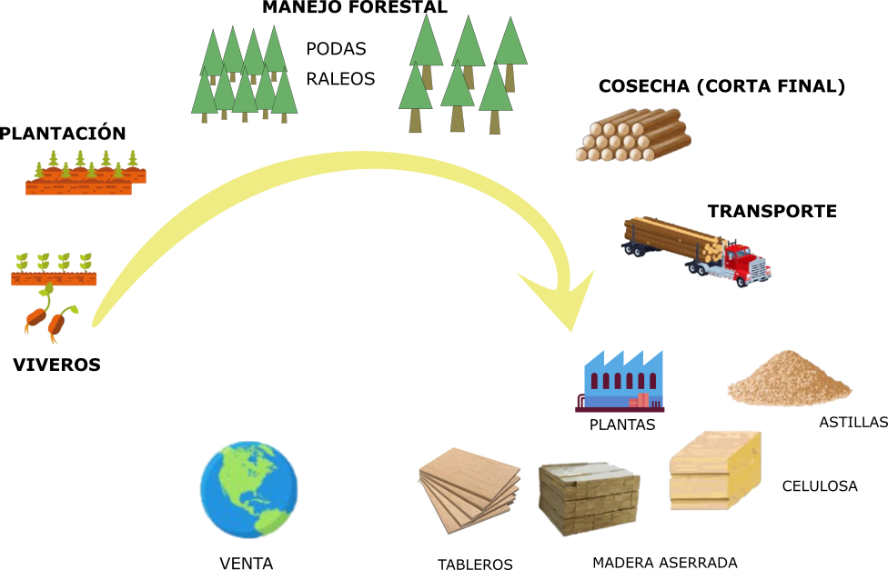
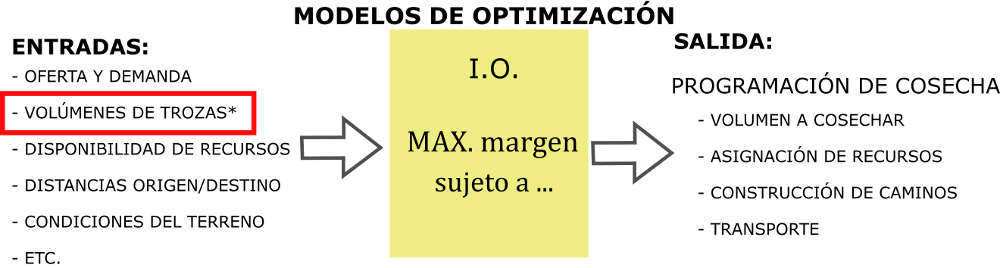
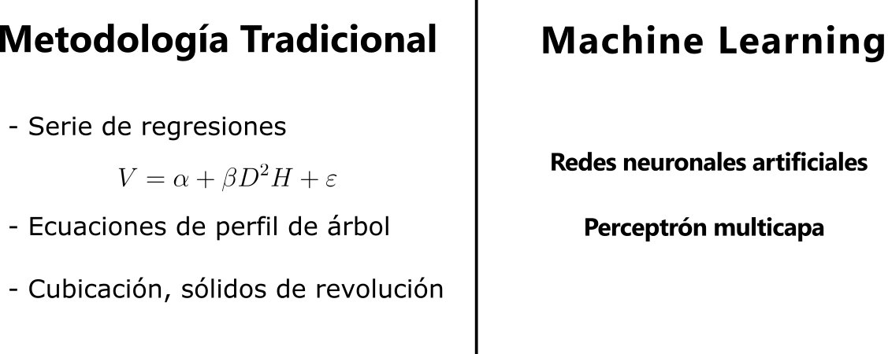
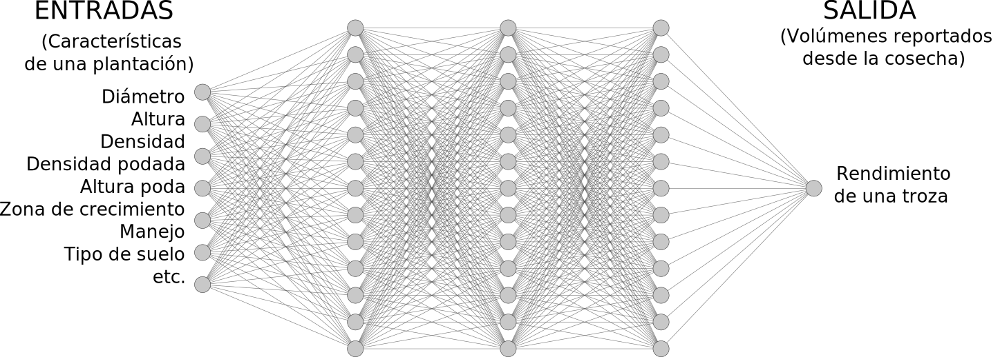

```{r setup, include=FALSE}
options(htmltools.dir.version = FALSE)
knitr::opts_chunk$set(message = FALSE, warning = FALSE)
library(tidyverse)
```

background-image: url(img/ucn.png)
background-size: 100px
background-position: 50% 7%


class: clear

<br><br><br>
<p style="text-align:center;font-size: 16px;letter-spacing: 0.1em;font-family: "Helvetica Neue", Helvetica, Arial, sans-serif;color: #337ab7 ;">
  UNIVERSIDAD CATÓLICA DEL NORTE
  <br>
  ESCUELA DE INGENIERÍA
  <br>
  INGENIERÍA CIVIL INDUSTRIAL</p>

<br>

<p style="text-align:center;font-size: 22px; font-weight: bold;color:#29445c;"> Creación de modelo para la estimación trozas de madera en plantaciones forestales de Forestal Mininco S.A</p>

<hr style="border-color:red;border:15px;background-color:#a93f2b;height: 2px">

<p style="text-align:center;font-size: 16px;border-style: solid;border-width: 0px 40px 4px 40px; border-color: white;letter-spacing: 0.08em;">
  MEMORIA PARA OPTAR AL GRADO DE LICENCIADO EN CIENCIAS DE LA INGENIERÍA Y AL TÍTULO DE INGENIERO CIVIL INDUSTRIAL</p>

<p style="text-align:center;font-size: 16px;letter-spacing: 0.1em;font-family: "Helvetica Neue", Helvetica, Arial, sans-serif;color: #337ab7 ;">
<br>
  Patricio Ignacio Said Peralta
<br>
  Prof. Guías:
<br>
  Ing. Civil Mecánico Pedro Reyes Norambuena
<br>
  Ing. Ingeniero Civil Informático Claudio Parada Véliz
</p>

---
# Agenda
.font150[
 
* Antecedentes de la industria  
* Problemática - Objetivo - Alcance 
* Marco Teórico  
  + Modelo RNA
  + Estado del arte  
* Metodología  
  + Obtención - Limpieza - Exploración de los datos  
  + Entrenamiento  
* Resultados  
  + Implementación  
* Conclusiones
]
---


<div style="position: absolute; top: 20%; left:8%;">


</div>

# Antecedentes de la industria forestal

---
# Antecedentes de la industria forestal

Exportaciones forestales en 2018  

```{r echo=FALSE , warning= F, message= F, fig.height=4, fig.width=13, fig.align= "center"}
datos5 <-  readxl::read_excel("datos/exportacion_pais.xlsx") 
datos5 <- datos5[order(datos5$Monto), ] 
datos5$País <- factor(datos5$País, levels = datos5$País[order(datos5$Monto)])

datos5 %>% filter(Porcentaje > 0.014) %>% 
  ggplot( aes(x = País, y = Monto)) + 
  geom_col(fill= "#6B8A47" ) +     
  coord_flip() +   
  geom_text(aes(  label = paste0(sub(".",",",
                                     as.character(round(Porcentaje*100,1)),fixed = T),"%")  ), 
            size = rel(5), fontface = "bold" , hjust= -0.1 , color = "gray33")+    
  scale_y_continuous(limits = c(0, 180) , 
                     labels =  function(x) format(x, big.mark = ".", scientific = FALSE)  ) +   
  theme_light()+   
  theme(        
        axis.title.y = element_text(size = rel(1.5), angle = 90),           
        axis.title.x = element_text(size = rel(1.5)),         
        axis.text.y =  element_text(size = rel(1.5)),
        axis.text.x = element_text(size = rel(1.5)))+       
   
  labs(     x = "País de destino",     y = 'Monto (US$ millones FOB)' , caption = "Fuente: INFOR"   )
```

<div style="position: absolute; top: 60%; left:7%;">


</div>

---

class: split-two

# Especie: *Pinus Radiata D.Don* 

<p style="font-size: 24px;"> **Orígen: California**  </p>
.column[

<div style="position: absolute; top: 30%; left:20%;">


</div>

]

.column[
<div style="position: absolute; top: 20%;margin:0px auto; text-align:center;">


</div>
]

???

áreas de la costa central de California, desde San Mateo por el norte hasta San Luis Obispo
por el sur; tambi´ en habitan bosques naturales de pino radiata en dos islas mexicanas, la Isla
Guadalupe y la Isla Cedro, ubicadas a 800 kil´ ometros al sureste de San Luis Obispo  
pino insigne es la con´ıfera m´ as sembrada en el mundo al ser
una especie de rápido crecimiento y de cualidades deseables para madera de construcción
y pulpa

---
class: split-two

# Plantaciones de Pino radiata 

<p style="text-align:center;font-size: 24px;">**Rodal** es una plantación forestal (monoespecífica y coetánea).  </p>
.column[
<div style="position: absolute; top: 30%; left:15%;">


</div>

]

.column[
<div style="position: absolute; top: 30%;left:5%;margin:0px auto; text-align:center;">


</div>
]

???

corresponde a la vegetación contenida en una superficie definida de terreno y se caracteriza por una cierta similitud de su población arbórea: son monoespecíficas y coetáneas

---
# El ciclo forestal 
<div style="position: absolute; top: 20%; left:10%;">



</div>

---
class: clear
**Elaboración de madera contrachapada o plywood** (Fuente: cmpcmaderas.cl)
<div style="position: absolute; top: 10%; left:5%;">
<embed src="img/plywood.swf" width="780" height="655"></embed> 

---

# Planificación de la cosecha  

<div style="position: absolute; top: 20%; left:5%;">



</div>

---

# Planificación de la cosecha  

<div style="position: absolute; top: 20%; left:5%;">


</div>

<br><br><br><br><br><br><br><br>
## La problemática  

** *Estimaciones imprecisas de rendimiento de productos implican desviaciones entre el volumen planificado y el real cosechado* **

---

# Objetivos  

## **Objetivo general**  

* Crear un modelo para la estimación de rendimientos de trozas en plantaciones de pino radiata  

## **Objetivos específicos** 

* Identificar las variables que pueden afectar a la obtención de diferentes trozas  
* Entrenar y seleccionar una configuración óptima del modelo  
* Comparar los errores entre modelos entrenado y uno tradicional  
* Implementar los modelos seleccionados  

---

# Modelos de cubicación de madera  

<div style="position: absolute; top: 30%; left:5%;">



</div>

---

# Estado del Arte  

## Redes neuronales artificiales en el campo forestal  

* Predicción de la resistencia de tableros aglomerados (Cook y Chiu, 1997; Fernández et al., 2008; (Melo y Miguel, 2016).  
* Clasificación de defectos en chapas de madera  (Pham y Sagiroglu, 2000; Ramírez Alonso y Chacón Murguía, 2005).  
* Clasificación tipos de coníferas en Islas Canarias (Esteban et al., 2009).  
* Detección de incendios forestales (Alonso-Betanzos et al., 2003).  
* Predicción de mortalidad en plantaciones forestales  (Hasenauer et al., 2001).  
* Estimación de cobertura forestal (Rodríguez et al., 2002).
* Estimación de alturas de diferentes especies forestales (López et al., 2012; Martins et al., 2016).  
* Predicción del índice de sitio en bosques del Mediterráneo (Aertsen et al. 2010).  
* **Estimación volúmenes de diferentes especies forestales **(Vinícius Oliveira Castro et al., 2013; López, Arce, y Arévalo 2012; Miguel et al., 2016; De Oliveira Lima et al., 2017; Martins et al., 2016; Vieira et al., 2018).  

---
background-image: url(img/esquema.svg)
background-size: 80%

# Metodología 


---

background-image: url(img/inventarios_zona.svg)
background-size: 500px
background-position: 93% 83%
# Toma de datos  

### ¿Qué variables podría incluir en el modelo?  

* Características de la plantaciones (provenientes de **inventarios forestales**) 
 + Diámetro  
 + Altura  
 + Densidad (árboles por superficie)
 + Altura podada  
* Variables productivas   
 + Zonas de crecimiento (Schlatter y Gerding (1995)) 
 + Tipo de suelo  
 + Esquema de manejo (régimen silvícola)
---
background-image: url(img/limpieza.svg)
background-size: 320px
background-position: 93% 83%

# Limpieza de datos
#### Corrección/eliminación de inconsistecias, registros faltantes, duplicados, normalización, ordenamiento y estructura del conjunto. 

### **Conjunto de datos acorde a los alcances del proyecto:**  
* Inventarios de pre-cosecha  
  + Tiempo inventario-cosecha < 5 años
  + Plantaciones adultas > 15 años
* Superficie cosechada (rodal) > 5 ha  
* Volumen cosechado (rodal) > 1000 m³
* Inconsistencia en volúmenes:  
  + Ejemplo: producto podado en rodades pulpable  
* Plantaciones con volumen siniestrado (no considerados) 
---
# Exploración de los datos

```{r echo=FALSE , warning= F, message= F}
library(highcharter)
datos <- readxl::read_excel("datos/datos_inventarios.xlsx")

#datos3$COD_Z_CPINO <- as.factor(datos3$COD_Z_CPINO) 
#levels(datos3$COD_Z_CPINO) <- c("I" , "II" , "III" , "IV" , "V" , "VI" , "VII" , "VIII" , "IX" , "X")
datos$ESQUEMA <- factor(datos$ESQUEMA,     levels = c('INTENSIVO','EXTENSIVO' , "MULTIPROPOSITO" , "PULPABLE"),ordered = TRUE) 
levels(datos$ESQUEMA) <- c("Intensivo" , "Extensivo" , "Multipropósito" , "Pulpable") 

x <- c("ESQUEMA", "ALTURA_MEDIA", "DAP_MEDIO", "EDAD_OT", "DENSIDAD")
y <- str_c("{point.", x, "}")
x <- str_replace_all(x, "_", " ")
tt <- tooltip_table(x, y)


hc3 <- hchart(datos, "scatter", hcaes(x = DAP_MEDIO, y = ALTURA_MEDIA, group = ESQUEMA)) %>% 
  hc_tooltip(pointFormat = tt, useHTML = TRUE, headerFormat = "") %>% 
  hc_title(
    text = "Relación altura y diámetro de las plantaciones.",
    useHTML = TRUE) %>% 
  hc_yAxis(title= list(text="Altura media (m)",
                       style = list(fontSize = "15px")),
           labels = list(style = list(fontSize = "11px"))) %>% 
  hc_xAxis(title= list(text="Diámetro medio (cm)",
                       style = list(fontSize = "15px")),
           labels = list(style = list(fontSize = "11px")))

htmlwidgets::saveWidget(hc3, "highchrt_ex3.html")
```

<iframe src="highchrt_ex3.html" width = "800px", height = "580px" frameBorder="0"></iframe>


---

# Exploración de los datos

```{r echo=FALSE , warning= F, message= F}

hc5 <- hchart(datos, "scatter", hcaes(x = DAP_MEDIO, y = DENSIDAD, group = ESQUEMA)) %>% 
  hc_tooltip(pointFormat = tt, useHTML = TRUE, headerFormat = "") %>% 
  hc_title(
    text = "Relación la altura media y la densidad de la plantación.",useHTML = TRUE) %>% 
  hc_yAxis(title= list(text="Densidad (arb/ha)",
                       style = list(fontSize = "15px")),
           labels = list(style = list(fontSize = "11px"))) %>% 
  hc_xAxis(title= list(text="Diámetro medio (cm)",
                       style = list(fontSize = "15px")),
           labels = list(style = list(fontSize = "11px")))

htmlwidgets::saveWidget(hc5, "highchrt_ex5.html")
```
<iframe src="highchrt_ex5.html" width = "800px", height = "580px" frameBorder="0"></iframe>

---
# Pre procesado  


### Normalización:  
Los datos se escalaron en un rango de [0 a 1]
$$X_{escalado}=\frac{X-X_{min}}{X_{min}-X_{max}}$$  

### Variables ficticias:

Las variables categóricas => *one hot encoding*  
* Zona de crecimiento 
  + (10 zonas: I a X)  
* Tipo de suelo  
  + (8 tipos: trumao, sedimentos marinos, secano, metamórficos, graníticos, arenas, arcilloso, aluviales)  
* Esquema de manejo  
  + (4 esquemas: Intensivo, extensivo, multipropósito, pulpable)  
* PLI  
  + (2 estados : con o sin potencial para extraer madera *clear*)  

---

class: clear

### Variables ficticias para la variable `zona de crecimiento`  

<div style="position: absolute; top: 20%;  left:27%;">


```{r  echo = F, message = F , eval = T, warning = F}
library(kableExtra) 
library(tidyverse)

datos <- data.frame(E1 = c(1,0,0,0,0,0,0,0,0,0), 
                    E2 = c(0,1,0,0,0,0,0,0,0,0),
                    E3 = c(0,0,1,0,0,0,0,0,0,0),
                    E4 = c(0,0,0,1,0,0,0,0,0,0),
                    E5 = c(0,0,0,0,1,0,0,0,0,0),
                    E6 = c(0,0,0,0,0,1,0,0,0,0),
                    E7 = c(0,0,0,0,0,0,1,0,0,0),
                    E8 = c(0,0,0,0,0,0,0,1,0,0),
                    E9 = c(0,0,0,0,0,0,0,0,1,0),
                   E10 = c(0,0,0,0,0,0,0,0,0,1)
)
rownames(datos)<- c("Zona I", "Zona II", "Zona III",
                    "Zona IV", "Zona V", "Zona VI", "Zona VII",
                    "Zona VIII", "Zona IX", "Zona X")
datos %>% kable()%>%
kable_styling(bootstrap_options = c("striped", "hover", "condensed"))
```

</div>

---
class: split-two
# Redes neuronales artificiales

.row[
<div style="position: absolute; top: 30%; left:25%;">


</div>

]

.row[
<div style="position: absolute; top: 5%; left:30%;">


</div>
]
---
# Redes neuronales artificiales

<div style="position: absolute; top: 15%; left:20%;">


</div>

<div style="position: absolute; top: 64%; left:3%;">


</div>

---
# Entrenamiento de la red  
<div style="position: absolute; top: 30%; left:5%;">



</div>  

---
background-image: url(img/trozado.svg)
background-size: 600px
background-position: 50% 100%

# Resultados  

** Tabla con métricas de precisión para la estimación de troza podada  **
```{r  echo = F, message = F , eval = T, warning = F}
datos_tabla <- readxl::read_excel("datos/tabla_errores.xlsx")
library(kableExtra)
datos_tabla %>%    select(-starts_with("MSE")) %>% filter(Producto == "Clear A")%>% select(-Producto) %>% 
  kable( format.args = list(decimal.mark = ',', big.mark = "."),
         col.names = c( "Modelo",rep(c("RECM","EAM","R"),3)), 
         digits = c(1,1,rep(c(2,2,3),3)))%>%    		
  kable_styling(bootstrap_options =c( "condensed", "stripped"),font_size = 13)%>% 
  add_header_above(c(" "=1, "Entrenamiento (n = 608)"= 3, "Validación (n = 127)" = 3, "Prueba (n = 129)" = 3)) %>% 
  row_spec(c(3), bold = T, color = "white", background = "#D7261E") %>% 
  row_spec(4, bold = T)
```


---
# Resultados 

```{r echo=FALSE , warning= F, message= F, fig.height=8, fig.width=10, fig.align= "center"}
datos_2 <- readxl::read_excel("datos/tabla_errores_graficas.xlsx") 
datos_2 %>%  
  mutate(conjunto = factor(conjunto,levels=c("train", "valid","test"), 
                                    labels = c("Entrenamiento","Validación","Prueba"))) %>% 
  mutate(producto = factor(producto_2, 
                        labels = c("Podado","Semi-Podado","Industrial","Pulpable" ))) %>% 
  mutate(error = real - estimado) %>% 
  filter(conjunto == "Prueba")%>% 
ggplot( aes(x=error, fill=Modelo)) +   
  geom_histogram( position="dodge", bins = 8, alpha= 1)+    
  labs(y= "Frecuencia", x= "Error", color= "Modelo" , fill="Modelo" , title = "Histograma disperción de los errores de modelos de RNA y uno tradicional (conjunto de prueba)")+
  theme_light()+    
  facet_wrap(~producto,ncol = 2,  scales = "free")+  
  theme(legend.position="bottom",legend.box.spacing = unit(0, "cm"), 
                legend.spacing.y = unit(1, 'cm'),
        strip.text.x = element_text(margin = margin(0.1, 0.1, 0.1, 0.1, "cm") , 
                                    size = 12, color = "black") , 
        axis.text.x = element_text(size = 10), 
        axis.text.y = element_text(size = 10),
        axis.title.x = element_text(size = 12),
        axis.title.y = element_text(size = 12),
        legend.text = element_text(size = 12),
        legend.title  = element_text(size = 12)
  ) 
```
---
# Discusión  

* Mejoras significativas en la estimación de rendimiento de troza podada y semi-podada entre modelos de RNA y tradicional.  

* Modelos de RNA con variables cualitativas no mejoraron la precisión significativamente.  (Mena y Montecinos, 2006; Vieira, 2018)  

* La arquitectura de redes para estimación de troza pulpable e industrial fue compacta, mientras que para las trozas podadas fueron de mayor tamaño.  

* Importancia de las configuraciones de las redes y la partición de los datos para evitar sobre-entrenamiento.  

---

# Implementación

<div class = "l-page"  style="top: 10%; left:0%;">
<iframe src="https://psaid.shinyapps.io/ainsigne/" width="700%" height="550px"
style="border:none;"></iframe>
</div>
 <a href="https://psaid.shinyapps.io/ainsigne/ "> psaid.shinyapps.io/ainsigne </a>

---
class: inverse, center, middle

# Conclusión

---
# Trabajo futuro  

* Reproducir con un conjunto de datos más grande.  

* Aplicar otro tipo de algoritmo (RNN, CNN, Super Learner Algorithm).  

* Aplicar en otros problemas, por ejemplo:    
  + Estimación de alturas  
  + Estimación de volumen sin tener altura total  
  + Simular crecimiento  
  + Mortalidad  


---
# Trabajo futuro 

<iframe width="800" height="550" src="https://www.youtube.com/embed/4tIT8VHGmJk" frameborder="0" allow="accelerometer; autoplay; encrypted-media; gyroscope; picture-in-picture" allowfullscreen></iframe> 
---


class: clear,center, middle, inverse

# Gracias

Códigos y datos utilizados: [**patosaid.github.io/ainsigne**](https://patosaid.github.io/ainsigne/)


---


# Referencias   


<div style="font-size:12pt">

<ul>
<li>Aertsen, Wim, Vincent Kint, Jos van Orshoven, Kürşad Özkan, y Bart Muys. 2010. «Comparison and ranking of different modelling techniques for prediction of site index in Mediterranean mountain forests». Ecological Modelling 221 (8):1119-30.</li> 
<li>Alonso-Betanzos, A., Fontenla-Romero, O., Guijarro-Berdinas, B., Hernández-Pereira, E., Andrade, M. I. P., Jiménez, E., Soto, J. L. L., y Carballas, T. (2003). An intelligent system for forest fire risk prediction and fire fighting management in galicia. Expert Systems with Applications, 25(4):545–554.</li>  
<li>Cook, D. F. y Chiu, C.-C. (1997). Predicting the internal bond strength of particleboard, utilizing a radial basis function neural network. Engineering Applications of Artificial Intelligence , 10(2):171–177.</li> 
<li>De Oliveira Lima, Mirella Basileu, Ilvan Medeiros Lustosa Junior, Elian Meneses Oliveira, J&essica Cristina Barbosa Ferreira, Kálita Luis Soares, y Eder Pereira Miguel. 2017. «Artificial neural networks in whole-stand level modeling of Eucalyptus plants». African Journal of Agricultural Research 12 (7): 524-34.</li>  
<li>Esteban, L. G., Fernández, F. G., de Palacios de Palacios, P., Romero, R. M., y Cano, N. N. (2009). Artificial neural networks in wood identification: The case of two juniperus species from the canary islands. IAWA Journal, 30(1):87–94.</li>
<li>Fernández, F. G., Esteban, L. G., Palacios, P. D., Navarro, M., y Conde, M. (2008). Prediction of standard particleboard mechanical properties utilizing an artificial neural network and subsequent comparison with a multivariate regression model. Investigación Agraria: Sistemas y Recursos Forestales, 17(2):178.</li>
<li>Hasenauer, H., Merkl, D., y Weingartner, M. (2001). Estimating tree mortality of norway spruce stands with neural networks. Advances in Environmental Research, 5(4):405–414.</li> 
<li>Haykin, Simon S. (2009). Neural networks and learning machines. New York: Prentice Hall.</li> 
<li> Lopez, J., Arce, C., y Arévalo, R. (2012). Aplicación de la técnica de redes neuronales para la predicción de la altura de árboles de algunas especies maderables promisorias presentes en plantaciones forestales de colombia. Revista Tumbaga, 7:97–106.</li>


</ul>
</div>

---
# Referencias  

<div style="font-size:12pt">

<ul>
<li>Martins, E., Binoti, M., Leite, H., Binoti, D., y Dutra, G. (2016). Configuracao de redes neurais artificiais para estimacao da altura total de árvores de eucalipto. Revista Brasileira de Ciencias Agrárias - Brazilian Journal of Agricultural Sciences, 11(2):117–123.</li>
<li>Melo, R. R. d. y Miguel, E. P. (2016). Use of artificial neural networks in predicting particleboard quality parameters. Revista Arvore, 40(5):949–958.</li>
<li>Pham, D. T. y Sagiroglu, S. (2000). Neural network classification of defects in veneer boards. Proceedings of the Institution of Mechanical Engineers, Part B: Journal of Engineering Manufacture , 214(3):255–258.</li> 
<li>Ramírez Alonso, G. M. d. J. y Chacón Murguía, M. I. (2005). Clasificación de defectos en madera utilizando redes neurales artificiales. Computación y Sistemas, 9(1):17–27.</li>
<li>Rodríguez, E. B., P´ erez, E. V., Ovalle, Á. L., y Domínguez, S. T. (2002). Aplicación de redes neuronales artificiales y técnicas sig para la predicción de coberturas forestales. Revista Chapingo. Serie Ciencias Forestales y del Ambiente, 8(1):31–37.</li>
<li>Tariq Rashid (2007). A Gentle Introductionto Neural Networks(with Python) PyCon Italy, https://www.pycon.it/media/conference/slides/a-gentle-introduction-to-neural-networks-with-python.pdf.</li>
<li>Vinícius Oliveira Castro, Renato, Carlos Pedro Boechat Soares, Helio Garcia Leite, Agostinho Lopes de Souza, Gilciano Saraiva Nogueira, y Fabrina Bolzan Martins. 2013. «Individual growth model for Eucalyptus stands in Brazil using artificial neural network». ISRN Forestry 2013.</li>
</ul>
</div>

---


class: inverse, center, middle

# Anexos

<html><div style='float:left'></div><hr color='#EB811B' size=1px width=720px></html>
---
background-image: url(img/anexo/1.PNG)
background-size: 750px
background-position: 50% 35%
# El perceptrón multicapa MLP

---
background-image: url(img/anexo/2.PNG)
background-size: 500px
background-position: 45% 35%
# El perceptrón multicapa MLP

---
class: split-two
background-image: url(img/anexo/3.PNG)
background-size: 700px
background-position: 50% 10%
# El perceptrón multicapa MLP

.row[

]

.row[
$$ W_{ij} Y_i = V_j$$
$$ Y_j = F(V_j)$$
]
.row[

<div style="position: absolute; top: 68%; left:10%;">


</div>
]

---
background-image: url(img/anexo/gradiente.PNG)
background-size: 850px
background-position: 50% 35%
# El perceptrón multicapa MLP

### Descenso de la gradiente 

---
background-image: url(img/anexo/gradiente2.PNG)
background-size: 750px
background-position: 50% 55%
# El perceptrón multicapa MLP

### Descenso de la gradiente 

---
background-image: url(img/anexo/valle.PNG)
background-size: 750px
background-position: 50% 55%
# El perceptrón multicapa MLP

### Descenso de la gradiente 

---
background-image: url(img/anexo/gradiente3.PNG)
background-size: 600px
background-position: 50% 10%
# El perceptrón multicapa MLP

--

<div style="position: absolute; top: 40%; left:15%;">


</div>


