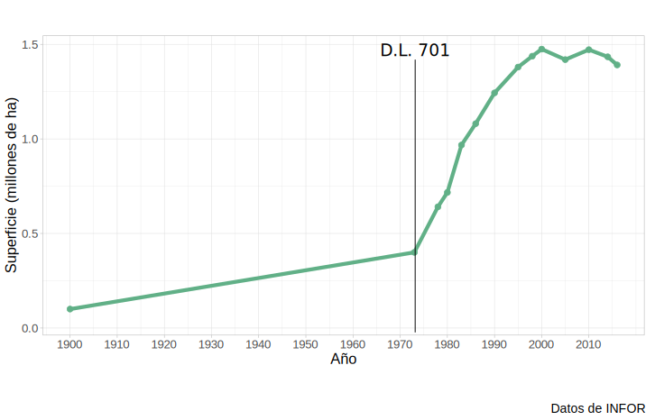

```{r setup, include=FALSE}
options(htmltools.dir.version = FALSE)
knitr::opts_chunk$set(message = FALSE, warning = FALSE)
library(tidyverse)
```

background-image: url(img/ucn.png)
background-size: 100px
background-position: 50% 7%


class: clear

<br><br><br>
<p style="text-align:center;font-size: 16px;letter-spacing: 0.1em;font-family: "Helvetica Neue", Helvetica, Arial, sans-serif;color: #337ab7 ;">
  UNIVERSIDAD CATÓLICA DEL NORTE
  <br>
  ESCUELA DE INGENIERÍA
  <br>
  INGENIERÍA CIVIL INDUSTRIAL</p>

<br>

<p style="text-align:center;font-size: 22px; font-weight: bold;color:#29445c;"> Creación de modelo para la estimación trozas de madera en plantaciones forestales de Forestal Mininco S.A</p>

<hr style="border-color:red;border:15px;background-color:#a93f2b;height: 2px">

<p style="text-align:center;font-size: 16px;border-style: solid;border-width: 0px 40px 4px 40px; border-color: white;letter-spacing: 0.08em;">
  MEMORIA PARA OPTAR AL GRADO DE LICENCIADO EN CIENCIAS DE LA INGENIERÍA Y AL TÍTULO DE INGENIERO CIVIL INDUSTRIAL</p>

<p style="text-align:center;font-size: 16px;letter-spacing: 0.1em;font-family: "Helvetica Neue", Helvetica, Arial, sans-serif;color: #337ab7 ;">
<br>
  Patricio Ignacio Said Peralta
<br>
  Prof. Guías:
<br>
  Ing. Civil Mecánico Pedro Reyes Norambuena
<br>
  Ing. Ingeniero Civil Informático Claudio Parada Véliz
</p>

---
# Agenda
.font200[
 
* Antecedentes de la industria  
* Objetivo - Alcance 
* Metodología  
  + Estado del arte  
* Resultados  
]
---


<div style="position: absolute; top: 20%; left:8%;">



</div>

# Antecedentes de la industria forestal

---
# Antecedentes de la industria forestal

Exportaciones forestales en 2018  

```{r echo=FALSE , warning= F, message= F, fig.height=4, fig.width=13, fig.align= "center"}
datos5 <-  readxl::read_excel("datos/exportacion_pais.xlsx") 
datos5 <- datos5[order(datos5$Monto), ] 
datos5$País <- factor(datos5$País, levels = datos5$País[order(datos5$Monto)])

datos5 %>% filter(Porcentaje > 0.014) %>% 
  ggplot( aes(x = País, y = Monto)) + 
  geom_col(fill= "#6B8A47" ) +     
  coord_flip() +   
  geom_text(aes(  label = paste0(sub(".",",",
                                     as.character(round(Porcentaje*100,1)),fixed = T),"%")  ), 
            size = rel(5), fontface = "bold" , hjust= -0.1 , color = "gray33")+    
  scale_y_continuous(limits = c(0, 180) , 
                     labels =  function(x) format(x, big.mark = ".", scientific = FALSE)  ) +   
  theme_light()+   
  theme(        
        axis.title.y = element_text(size = rel(1.5), angle = 90),           
        axis.title.x = element_text(size = rel(1.5)),         
        axis.text.y =  element_text(size = rel(1.5)),
        axis.text.x = element_text(size = rel(1.5)))+       
   
  labs(     x = "País de destino",     y = 'Monto (US$ millones FOB)' , caption = "Fuente: INFOR"   )
```

<div style="position: absolute; top: 60%; left:7%;">


</div>

---

class: split-two

# Especie: *Pinus Radiata D.Don* 

<p style="font-size: 24px;"> **Orígen: California**  </p>
.column[


<div style="position: absolute; top: 30%; left:20%;">


</div>

]

.column[
<div style="position: absolute; top: 20%;margin:0px auto; text-align:center;">


</div>
]

???

áreas de la costa central de California, desde San Mateo por el norte hasta San Luis Obispo
por el sur; tambi´ en habitan bosques naturales de pino radiata en dos islas mexicanas, la Isla
Guadalupe y la Isla Cedro, ubicadas a 800 kil´ ometros al sureste de San Luis Obispo  
pino insigne es la con´ıfera m´ as sembrada en el mundo al ser
una especie de rápido crecimiento y de cualidades deseables para madera de construcción
y pulpa

---
class: split-two

# Rodales de Pino radiata 

<p style="text-align:center;font-size: 24px;">**Rodal** es una plancatión forestal (monoespecífica y coetánea).  </p>
.column[
<div style="position: absolute; top: 30%; left:10%;">


</div>

]

.column[
<div style="position: absolute; top: 30%;margin:0px auto; text-align:center;">


</div>
]

???

corresponde a la vegetación contenida en una superficie definida de terreno y se caracteriza por una cierta similitud de su población arbórea: son monoespecíficas y coetáneas

---
# El ciclo forestal 
<div style="position: absolute; top: 20%; left:20%;">


</div>

---
class: clear
**Elaboración de madera contrachapada o plywood** (Fuente: cmpcmaderas.cl)
<div style="position: absolute; top: 10%; left:5%;">
<embed src="img/plywood.swf" width="780" height="655"></embed>

