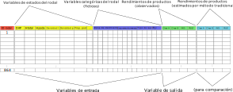

```{r setup, include=FALSE}
options(htmltools.dir.version = FALSE)
```


background-image: url(img/limpieza.svg)
background-size: 320px
background-position: 93% 83%

# Limpieza de datos
#### Corrección/eliminación de inconsistecias, registros faltantes, duplicados, normalización, ordenamiento y estructura del conjunto. 

### **Conjunto de datos acorde a los alcances del proyecto:**  
* Inventarios de pre-cosecha  
  + Tiempo inventario-cosecha < 5 años
  + Rodales adultos > 15 años
* Superficie cosechada (rodal) > 5 ha  
* Volumen cosechado (rodal) > 1000 m³
* Inconsistencia en volúmenes:  
  + Ejemplo: producto podado en rodades pulpable  
* Rodales con volumen siniestrado (no considerados)  

---
# Pre-procesamiento de los datos

### Normalización:  
Los datos se escalaron en un rango de [0 a 1]
$$X_{escalado}=\frac{X-X_{min}}{X_{min}-X_{max}}$$  
--

### Variables ficticias:

Las variables de tipo factor => *dummy variables*  
* Zona de crecimiento 
  + (10 zonas: I a X)  
* Tipo de suelo  
  + (8 tipos: trumao, sedimentos marinos, secano, metamórficos, graníticos, arenas, arcilloso, aluviales)  
* Esquema de manejo  
  + (4 esquemas: Intensivo, extensivo, multipropósito, pulpable)  
* PLI  
  + (2 estados : con o sin potencial para extraer madera *clear*)  

---

class: clear

### Variables ficticias para la variable `zona de crecimiento`  

<div style="position: absolute; top: 20%;  left:27%;">


```{r  echo = F, message = F , eval = T, warning = F}
library(kableExtra) 
library(tidyverse)

datos <- data.frame(E1 = c(1,0,0,0,0,0,0,0,0,0), 
                    E2 = c(0,1,0,0,0,0,0,0,0,0),
                    E3 = c(0,0,1,0,0,0,0,0,0,0),
                    E4 = c(0,0,0,1,0,0,0,0,0,0),
                    E5 = c(0,0,0,0,1,0,0,0,0,0),
                    E6 = c(0,0,0,0,0,1,0,0,0,0),
                    E7 = c(0,0,0,0,0,0,1,0,0,0),
                    E8 = c(0,0,0,0,0,0,0,1,0,0),
                    E9 = c(0,0,0,0,0,0,0,0,1,0),
                   E10 = c(0,0,0,0,0,0,0,0,0,1)
)
rownames(datos)<- c("Zona I", "Zona II", "Zona III",
                    "Zona IV", "Zona V", "Zona VI", "Zona VII",
                    "Zona VIII", "Zona IX", "Zona X")
datos %>% kable()%>%
kable_styling(bootstrap_options = c("striped", "hover", "condensed"))
```

</div>
  
---
class: clear


```{r echo=FALSE , warning= F, message= F}
datos <- readxl::read_excel("datos/datos_inventarios.xlsx")
library(tidyverse)
library(plotly)
#datos3$COD_Z_CPINO <- as.factor(datos3$COD_Z_CPINO) 
#levels(datos3$COD_Z_CPINO) <- c("I" , "II" , "III" , "IV" , "V" , "VI" , "VII" , "VIII" , "IX" , "X")
datos$ESQUEMA <- factor(datos$ESQUEMA,     levels = c('INTENSIVO','EXTENSIVO' , "MULTIPROPOSITO" , "PULPABLE"),ordered = TRUE) 
levels(datos$ESQUEMA) <- c("Intensivo" , "Extensivo" , "Multipropósito" , "Pulpable") 

p <- plot_ly(datos, x = ~DAP_MEDIO, y = ~ALTURA_MEDIA, z = ~DENSIDAD, 
        marker = list(color = ~AREA_BASAL, colorscale = c('#ffb3a1', '#683531'),size = 5, showscale = TRUE)) %>%
  add_markers() %>%
  layout(scene = list(xaxis = list(title = 'DAP medio (cm)'),
                     yaxis = list(title = 'Altura media (m)'),
                     zaxis = list(title = 'Densidad (arb/ha)')),
         annotations = list(
           x = 1.13,
           y = 1.05,
           text = 'Área basal (m²/ha)',
           xref = 'paper',
           yref = 'paper',
           showarrow = FALSE
         ))

htmlwidgets::saveWidget(p, "plotly1.html")
```
<div style="position: absolute; top: 0%; left:0%;">
<iframe src="plotly1.html" width = "1000px", height = "700px" frameBorder="0"></iframe>
<div>

---


# Estructura del conjunto de datos

<div style="position: absolute; top: 20%; left:1%;">



</div>