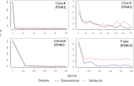

```{r setup, include=FALSE}
options(htmltools.dir.version = FALSE)
```


class: inverse, center, middle

# Entrenamiento de los modelos
<html><div style='float:left'></div><hr color='#EB811B' size=1px width=720px></html>

---

# Configuración de las RNA

#### Búsqueda de parámetros *"Grid Search"*  
* **Arquitectura de las redes** : 
  + **Capa de entrada**: Según las variables de entradas. [35] (nodos) para 15 variables, [17] para 8 variables, [7] 7 variables.
  + **Capas ocultas**: [20], [32], [50], [20:20], [256:256], [56:56],[20:20:20], [128:128:128],[300:300] , [100:300:100], [300:300:300],
[256:256:256], [56:56:56:56].
  + **Capa de salida**: Rendimiento de cada producto.  
* **Función de activación**:  
  + `tanh`
  + `rectifier` (`ReLU`)  
  + `maxout`   
* **Tasa de aprendizaje**:  
  +  0.005 ,0.02, 0.05, 0.1, 0.25, 0.5.  
* **Criterios de detención**:  
  + **Épocas**:  20, 50, 100, 500, 800.
  + **Rondas**:  3, 4.  
      + 4% de ECM.  
      
---
class: inverse, center, middle

# Evaluación de los resultados
<html><div style='float:left'></div><hr color='#EB811B' size=1px width=720px></html>
---
# Métricas de precisión   

Para la evaluación de los modelos se consideraron:  

$${ECM}=\frac{1}{n}\sum_{i=1}^{n}(y_{i}-\hat{y_{i}})^{2}$$
$${RECM}=\sqrt{\frac{1}{n}\sum_{i=1}^{n}(y_{i}-\hat{y_{i}})^{2}}$$
$${EAM}=\frac{1}{n}\sum_{i=1}^{n}|y_{i}-\hat{y_{i}}|$$
$${R}_{y\hat{y}}=\frac{n\sum y_{i}\hat{y_{i}}-\sum y_{i}\sum\hat{y_{i}}}{\sqrt{n\sum y_{i}^{2}-(\sum y_{i})^{2}}\sqrt{n\sum\hat{y}_{i}^{2}-(\sum\hat{y_{i}})^{2}}}$$
donde, $y_{i}$ rendimiento observado , $\hat{y_{i}}$ rendimiento estimadio y $n$ cantidad de observaciones.  

---

```{r  echo = F, message = F , eval = T, warning = F}
library(knitr)
library(kableExtra) 
library(tidyverse) 
library(tidyr)
datos_tabla <- readxl::read_excel("datos/tabla_errores.xlsx")

datos_tabla %>% 
  kable( format.args = list(decimal.mark = ',', big.mark = "."),
         col.names = c("Salida", "Modelo",rep(c("ECM","RECM","EAM","R"),3)), 
         digits = c(1,1,rep(c(2,2,2,4),3)))%>%    		
  kable_styling(bootstrap_options =c( "condensed", "stripped"),font_size = 13)%>% 
  add_header_above(c(" "=2, "Entrenamiento (n = 608)"= 4, "Validación (n = 127)" = 4, "Prueba (n = 129)" = 4)) %>% 
     collapse_rows(columns = 1, valign = "top") 
```
---

```{r  echo = F, message = F , eval = T, warning = F}
 datos_tabla <- readxl::read_excel("datos/tabla_errores.xlsx")

datos_tabla %>% 
  kable( format.args = list(decimal.mark = ',', big.mark = "."),
         col.names = c("Salida", "Modelo",rep(c("ECM","RECM","EAM","R"),3)), 
         digits = c(1,1,rep(c(2,2,2,4),3)))%>%    		
  kable_styling(bootstrap_options =c( "condensed", "stripped"),font_size = 13)%>% 
  add_header_above(c(" "=2, "Entrenamiento (n = 608)"= 4, "Validación (n = 127)" = 4, "Prueba (n = 129)" = 4)) %>% 
     collapse_rows(columns = 1, valign = "top") %>% 
  row_spec(c(3,7,11,15), bold = T, color = "white", background = "#D7261E") %>% 
  row_spec(c(3,7,11,15)+1, bold = T)
```
---
# Configuraciones de los modelos de RNA

```{css, echo=F}
    /* Table width = 100% max-width */

    .remark-slide table{
        width: 100%;
    }

    /* Change the background color to white for shaded rows (even rows) */

    .remark-slide thead, .remark-slide tr:nth-child(2n) {
        background-color: white;
    }
```

```{r  echo = F, message = F , eval = T, warning = F}

tabla<- readxl::read_excel("datos/resultados_1.xlsx")

tabla <- tabla%>% mutate(tasa_a= str_replace(tasa_a,"0.","0,"))
tabla$...1 <- paste("RNA" , c(1:12),sep = "")
 tabla %>%   select(Salida, everything()) %>% 
  kable("html", booktabs= T,col.names = c("Salida" , "Modelo","Entradas", "Capas ocultas", "F(X)","$\\alpha$" ))%>%    		
  kable_styling(bootstrap_options =c("hover", "condensed", "stripped"),font_size = 13) %>% 
   collapse_rows(columns = 1, valign = "middle") %>% 
  footnote(symbol_manual = "",
           symbol =("Donde, DAP: diámetro a la altura de pecho promedio(cm); DAP Dom: diámetro a la altura de pecho dominante; HT: altura total media (m); H Dom: altura dominante (m); D: densidad media (arb/ha); DP: densidad podada (arb/ha); PP: proporción podada (%); G: área basal (m²/ha); E: edad en inventario (años); índice de sitio (m); HP: altura podada media (m), PLI: pruned log index (binario); TZ: tipo zona de crecimiento; TE: tipo de esquema de manejo; TS: tipo de suelo; $\\alpha$ = tasa de aprendizaje. Variable de salida en m³/ha."),threeparttable = T)    
 

```

---
# Configuraciones de los modelos de RNA

```{css, echo=F}
    /* Table width = 100% max-width */

    .remark-slide table{
        width: 100%;
    }

    /* Change the background color to white for shaded rows (even rows) */

    .remark-slide thead, .remark-slide tr:nth-child(2n) {
        background-color: white;
    }
```

```{r  echo = F, message = F , eval = T, warning = F}

tabla<- readxl::read_excel("datos/resultados_1.xlsx")

tabla <- tabla%>% mutate(tasa_a= str_replace(tasa_a,"0.","0,"))
tabla$...1 <- paste("RNA" , c(1:12),sep = "")
 tabla %>%   select(Salida, everything()) %>% 
  kable("html", booktabs= T,col.names = c("Salida" , "Modelo","Entradas", "Capas ocultas", "F(X)","$\\alpha$" ))%>%    		
  kable_styling(bootstrap_options =c("hover", "condensed", "stripped"),font_size = 13) %>% 
   collapse_rows(columns = 1, valign = "middle")  %>% 
  row_spec(c(3,6,9,12), bold = T, color = "white", background = "#D7261E") %>% 
  footnote(symbol_manual = "",
           symbol =("Donde, DAP: diámetro a la altura de pecho promedio(cm); DAP Dom: diámetro a la altura de pecho dominante; HT: altura total media (m); H Dom: altura dominante (m); D: densidad media (arb/ha); DP: densidad podada (arb/ha); PP: proporción podada (%); G: área basal (m²/ha); E: edad en inventario (años); índice de sitio (m); HP: altura podada media (m), PLI: pruned log index (binario); TZ: tipo zona de crecimiento; TE: tipo de esquema de manejo; TS: tipo de suelo; $\\alpha$ = tasa de aprendizaje. Variable de salida en m³/ha."),threeparttable = T)  

```

---
# Dispersión de errores (Prueba)

```{r echo=FALSE , warning= F, message= F, fig.height=7.4, fig.width=10, fig.align= "center"}
datos_2 <- readxl::read_excel("datos/tabla_errores_graficas.xlsx") 
library(ggplot2)
datos_2 %>%  
  mutate(conjunto = factor(conjunto,
                        levels=c("train", "valid","test"), 
                        labels = c("Entrenamiento","Validación","Prueba"))) %>% 
  mutate(producto = factor(producto_2, 
                       labels = c("Clear A","Clear B","Industrial","Pulpable" ))) %>% 
  mutate(error = real - estimado) %>%
  filter(conjunto == "Prueba") %>% 
ggplot( aes(x = estimado , y= error, color =Modelo))+
  geom_point(alpha = 1, size= 2)+       
  labs(x= "Estimado", y= "Error")+    
  labs(color = "Modelo")+     
  facet_wrap(~ producto ,ncol = 2,  scales = "free" )+    
  theme_light()+ 
  theme(legend.position="bottom",legend.box.spacing = unit(0, "cm"), 
                legend.spacing.y = unit(1, 'cm'),
        strip.text.x = element_text(margin = margin(0.1, 0.1, 0.1, 0.1, "cm") , 
                                    size = 12, color = "black") , 
        axis.text.x = element_text(size = 10), 
        axis.text.y = element_text(size = 10),
        axis.title.x = element_text(size = 12),
        axis.title.y = element_text(size = 12),
        legend.text = element_text(size = 12),
        legend.title  = element_text(size = 12))
```
---
# Dispersión de errores (Prueba)

```{r echo=FALSE , warning= F, message= F, fig.height=8, fig.width=10, fig.align= "center"}
datos_2 <- readxl::read_excel("datos/tabla_errores_graficas.xlsx") 
datos_2 %>%  
  mutate(conjunto = factor(conjunto,levels=c("train", "valid","test"), 
                                    labels = c("Entrenamiento","Validación","Prueba"))) %>% 
  mutate(producto = factor(producto_2, 
                                    labels = c("Clear A","Clear B","Industrial","Pulpable" ))) %>% 
  mutate(error = real - estimado) %>% 
  filter(conjunto == "Prueba")%>% 
ggplot( aes(x=error, fill=Modelo)) +   
  geom_histogram( position="dodge", bins = 8, alpha= 1)+    
  labs(y= "Frecuencia", x= "Error", color= "Modelo" , fill="Modelo")+
  theme_light()+    
  facet_wrap(~producto,ncol = 2,  scales = "free")+  
  theme(legend.position="bottom",legend.box.spacing = unit(0, "cm"), 
                legend.spacing.y = unit(1, 'cm'),
        strip.text.x = element_text(margin = margin(0.1, 0.1, 0.1, 0.1, "cm") , 
                                    size = 12, color = "black") , 
        axis.text.x = element_text(size = 10), 
        axis.text.y = element_text(size = 10),
        axis.title.x = element_text(size = 12),
        axis.title.y = element_text(size = 12),
        legend.text = element_text(size = 12),
        legend.title  = element_text(size = 12)
  ) 
```
---
# Historial del RECM en el entrenamiento

<div style="position: absolute; top: 20%; left:5%;">



</div>

---
# Acerca de los resultados

* Capas ocultas  
* Funciones y tasas de activación  
* Variables de importacias


---
class: inverse, middle, center  

# Implementación

<html><div style='float:left'></div><hr color='#EB811B' size=1px width=720px></html>

---
background-image: url(img/software.svg)
background-size: 800px
background-position: 50% 8%
# Software utilizado  

---

# Web app: <a href="https://psaid.shinyapps.io/ainsigne/ "> psaid.shinyapps.io/ainsigne </a>


<div class = "l-page"  style="top: 10%; left:0%;">
<iframe src="https://psaid.shinyapps.io/ainsigne/" width="700%" height="550px"
style="border:none;"></iframe>
</div>


