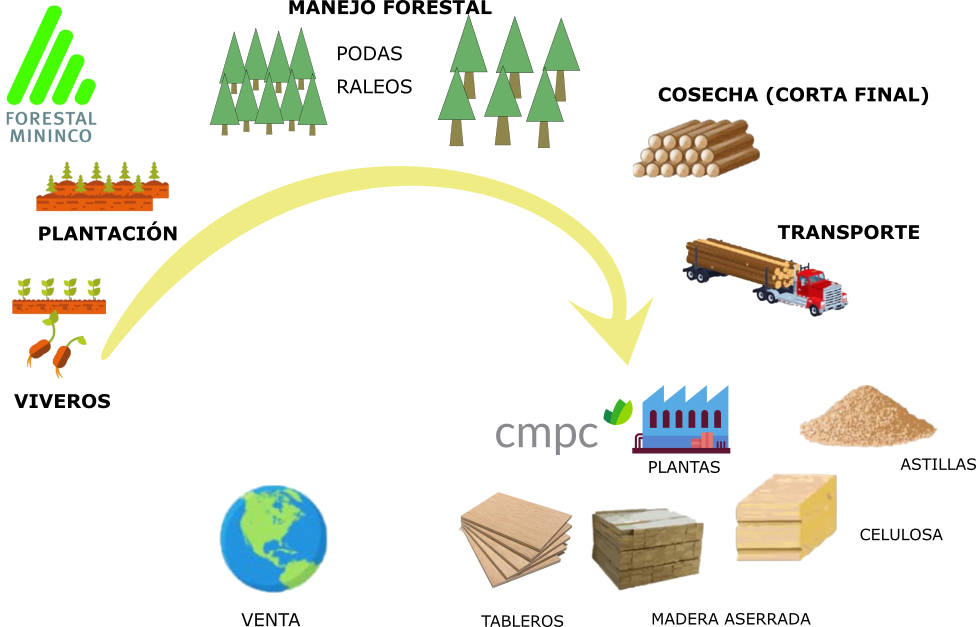
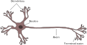
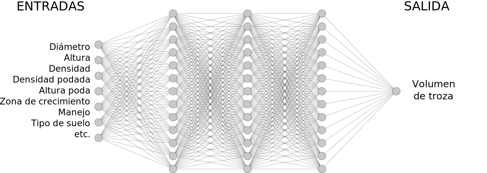
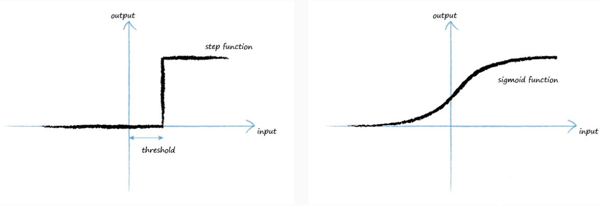

```{r setup, include=FALSE}
options(htmltools.dir.version = FALSE)
knitr::opts_chunk$set(message = FALSE, warning = FALSE)
library(tidyverse)
```

background-image: url(img/ucn.png)
background-size: 100px
background-position: 50% 7%


class: clear

<br><br><br>
<p style="text-align:center;font-size: 16px;letter-spacing: 0.1em;font-family: "Helvetica Neue", Helvetica, Arial, sans-serif;color: #337ab7 ;">
  UNIVERSIDAD CATÓLICA DEL NORTE
  <br>
  ESCUELA DE INGENIERÍA
  <br>
  INGENIERÍA CIVIL INDUSTRIAL</p>

<br>

<p style="text-align:center;font-size: 22px; font-weight: bold;color:#29445c;"> Creación de modelo para la estimación trozas de madera en plantaciones forestales de Forestal Mininco S.A</p>

<hr style="border-color:red;border:15px;background-color:#a93f2b;height: 2px">

<p style="text-align:center;font-size: 16px;border-style: solid;border-width: 0px 40px 4px 40px; border-color: white;letter-spacing: 0.08em;">
  MEMORIA PARA OPTAR AL GRADO DE LICENCIADO EN CIENCIAS DE LA INGENIERÍA Y AL TÍTULO DE INGENIERO CIVIL INDUSTRIAL</p>

<p style="text-align:center;font-size: 16px;letter-spacing: 0.1em;font-family: "Helvetica Neue", Helvetica, Arial, sans-serif;color: #337ab7 ;">
<br>
  Patricio Ignacio Said Peralta
<br>
  Prof. Guías:
<br>
  Ing. Civil Mecánico Pedro Reyes Norambuena
<br>
  Ing. Ingeniero Civil Informático Claudio Parada Véliz
</p>

---
# Agenda
.font150[
 
* La industria forestal en Chile
 + El ciclo de una plantación  
 + Planificación de cosecha  
* Alcance  
* Metodología  
  + Obtención - Limpieza - Exploración de los datos  
  + Resultados    
  + Implementación  
]

---


<div style="position: absolute; top: 20%; left:8%;">


</div>

# Antecedentes de la industria forestal
### Superficie de plantaciones de pino en Chile:

???

A inicios del siglo XX chile cargaba una pesada historia de utilización indiscriminada de sus bosques, se explotaba por diferentes motivos, extracción de materia prima, abrir espacio para ciudades, caminos, para la agricultura y ganaderia. Un punto de inflexión que marca a la industria forestal como la conocemos hoy en día ocurrió en 1974 con el DL 701. Desde ahí la tasa de plantación ha sido cercana a 100 mil ha/año. Hoy en Chile existen alrededor de 1 millón y medio de hectáreas de plancaciones de pino. Y +50% de las plantaciones se encuentran entre las regiones del biobio y la araucanía.  

---
background-image: url(img/numeros.png)
background-size: 70%
background-position: 50% 20%
# Antecedentes de la industria forestal

### Sector Forestal en 2018  

<div style="position: absolute; top: 60%; left:7%;">


</div>

???

Actualmente el sector forestal es la segunda industria más grande de Chile después de la minería, y que aporta aprox. 3% pib, generando mas de 100.000 empleos. En 2018 las exportaciónes sobrepasaron los 6 mil mill. de US y el principal destino de los productos fue China, seguido de EEUU japón y Europa. Los productos ...
---

class: split-two

# Especie: *Pinus Radiata D.Don* 

<h3> Orígen: California </h3>
.column[

<div style="position: absolute; top: 30%; left:20%;">


</div>

]

.column[
<div style="position: absolute; top: 20%;margin:0px auto; text-align:center;">


</div>
]

???

La especie en cuestión es el Pino Radiata,() . pino insigne es la conífera más sembrada en el mundo al ser una especie de rápido crecimiento y de cualidades deseables para madera de construcción, fabricación de pulpa, mueblería y decoración. 
Color amarillento pálido, 
Temperatura media anual
Entre 10 y 18ºC
lluvia superior a 380 mm  
altura hasta los 3000 msnm

---
class: split-two

# Plantaciones de Pino radiata 

<p style="font-size: 24px;">Una plantación forestal es monoespecífica y coetánea.  </p>
.column[
<div style="position: absolute; top: 30%; left:15%;">


</div>

]

.column[
<div style="position: absolute; top: 30%;left:5%;margin:0px auto; text-align:center;">


</div>
]

???

corresponde a la vegetación contenida en una superficie definida de terreno y se caracteriza por una cierta similitud de su población arbórea: son monoespecíficas y coetáneas

---
# El ciclo forestal  

<div style="position: absolute; top: 20%; left:10%;">



</div>

???

Ahora voy a 

---
class: clear
**Elaboración de madera contrachapada o plywood** (Fuente: cmpcmaderas.cl)
<div style="position: absolute; top: 10%; left:5%;">
<embed src="img/plywood.swf" width="780" height="655"></embed> 

---

# Planificación de la cosecha  

<div style="position: absolute; top: 20%; left:5%;">


</div>

---

# Planificación de la cosecha  

<div style="position: absolute; top: 20%; left:5%;">


</div>

<br><br><br><br><br><br><br><br>
## La problemática  

Errores en las estimaciones de volúmenes de productos conllevan a desviaciones entre el volumen planificado y el real cosechado

---

# Objetivos  

## **Objetivo general**  

* Crear un modelo para la estimación de rendimientos de trozas en plantaciones de pino radiata  

## **Objetivos específicos** 

* Identificar las variables que pueden afectar a la obtención de diferentes trozas  
* Ajutar y seleccionar una configuración óptima del modelo  
* Comparar los errores entre modelos entrenado y uno tradicional  
* Implementar los modelos seleccionados  

---

# Modelos de cubicación de madera  

<div style="position: absolute; top: 30%; left:5%;">


</div>

---
# Estado del Arte  

## Redes neuronales artificiales en el campo forestal  


<h3> Reconocimiento de imágen: </h3> 

* Detección de defectos en chapas de madera.
* Clasificación tipos de coníferas. 
* Detección de incendios forestales.


<h3> Estimación en plantaciones: </h3>  
* Predicción de mortalidad en plantaciones forestales .
* Simulación crecimiento de diámetro.  
* Estimación de alturas de diferentes especies forestales.
* **Estimación de volúmenes de diferentes especies forestales **(Vinícius Oliveira Castro et al., 2013; López, Arce, y Arévalo 2012; Miguel et al., 2016; De Oliveira Lima et al., 2017; Martins et al., 2016; Vieira et al., 2018).  

---
class: split-two
# Redes neuronales artificiales

.row[
<div style="position: absolute; top: 30%; left:25%;">


</div>

]

.row[
<div style="position: absolute; top: 5%; left:30%;">


</div>
]
---
# Redes neuronales artificiales

<div style="position: absolute; top: 15%; left:20%;">


</div>

<div style="position: absolute; top: 64%; left:3%;">


</div>


---
background-image: url(img/esquema.svg)
background-size: 80%

# Metodología 


---

background-image: url(img/inventarios_zona.svg)
background-size: 500px
background-position: 93% 83%
# Adquisición de datos  


<div style="float:left;width:20%;" >


 </div>
<div style="float:right;width:80%;" >
<ul>
 <li>Características de la plantaciones (provenientes de <b>inventarios forestales</b>) </li>
 <ul>
 <li> Diámetro  </li>
 <li> Altura  </li>
 <li> Densidad (árboles por superficie)</li>
 <li> Altura podada </li>
 </ul>
</ul>
<ul>
<li>Variables productivas </li>  
 <ul>
 <li> Zonas de crecimiento (Schlatter y Gerding (1995)) </li>
 <li> Tipo de suelo  </li>
 <li> Esquema de manejo (régimen silvícola)</li>
 </ul>
</ul>
 </div>
---
background-image: url(img/trozado.svg)
background-size: 700px
background-position: 70% 20%
# Adquisición de datos  


<div style="float:left;width:20%;" >


</div>
<div style="float:right;width:80%;" >
</div>
---
background-image: url(img/limpieza.svg)
background-size: 280px
background-position: 96% 50%

# Limpieza de datos


<div style="float:left;width:20%;" >


 </div>
<div style="float:right;width:80%;" >


<h4> Corrección/eliminación de inconsistecias, registros faltantes, duplicados, ordenamiento y estructura del conjunto. </h4> 

<h3> <b>Conjunto de datos acorde a los alcances del proyecto:</b> </h3>   

<ul>
<li>Inventarios de pre-cosecha  </li>
<ul>
  <li>Tiempo inventario-cosecha < 5 años</li>
  <li>Plantaciones adultas > 15 años</li>
</ul>
<li> Superficie cosechada (rodal) > 5 ha  </li>
<li> Volumen cosechado (rodal) > 1000 m³</li>
<li> Inconsistencia en volúmenes:  </li>
<ul>
  <li> Ejemplo: producto podado en rodades pulpable  </li>
</ul>
<li> Plantaciones con volumen siniestrado (no considerados) </li>

</ul>
 </div>
---
# Exploración de los datos

<div style="float:left;width:20%;" >


 </div>
<div style="float:right;width:80%;" >
```{r echo=FALSE , warning= F, message= F}
library(highcharter)
datos <- readxl::read_excel("datos/datos_inventarios.xlsx")

#datos3$COD_Z_CPINO <- as.factor(datos3$COD_Z_CPINO) 
#levels(datos3$COD_Z_CPINO) <- c("I" , "II" , "III" , "IV" , "V" , "VI" , "VII" , "VIII" , "IX" , "X")
datos$ESQUEMA <- factor(datos$ESQUEMA,     levels = c('INTENSIVO','EXTENSIVO' , "MULTIPROPOSITO" , "PULPABLE"),ordered = TRUE) 
levels(datos$ESQUEMA) <- c("Intensivo" , "Extensivo" , "Multipropósito" , "Pulpable") 

x <- c("ESQUEMA", "ALTURA_MEDIA", "DAP_MEDIO", "EDAD_OT", "DENSIDAD")
y <- str_c("{point.", x, "}")
x <- str_replace_all(x, "_", " ")
tt <- tooltip_table(x, y)


hc3 <- hchart(datos, "scatter", hcaes(x = DAP_MEDIO, y = ALTURA_MEDIA, group = ESQUEMA)) %>% 
  hc_tooltip(pointFormat = tt, useHTML = TRUE, headerFormat = "") %>% 
  hc_title(
    text = "Relación altura y diámetro de las plantaciones.",
    useHTML = TRUE) %>% 
  hc_legend(title = list(text="Manejo")) %>% 
  hc_yAxis(title= list(text="Altura media (m)",
                       style = list(fontSize = "15px")),
           labels = list(style = list(fontSize = "11px"))) %>% 
  hc_xAxis(title= list(text="Diámetro medio (cm)",
                       style = list(fontSize = "15px")),
           labels = list(style = list(fontSize = "11px")))

htmlwidgets::saveWidget(hc3, "highchrt_ex3.html")
```

<iframe src="highchrt_ex3.html" width = "800px", height = "580px" frameBorder="0"></iframe>
 </div>

---

# Exploración de los datos
<div style="float:left;width:20%;" >


 </div>
<div style="float:right;width:80%;" >
```{r echo=FALSE , warning= F, message= F}

hc5 <- hchart(datos, "scatter", hcaes(x = DAP_MEDIO, y = DENSIDAD, group = ESQUEMA)) %>% 
  hc_tooltip(pointFormat = tt, useHTML = TRUE, headerFormat = "") %>% 
  hc_title(
    text = "Relación la altura media y la densidad de la plantación.",useHTML = TRUE) %>% 
  hc_legend(title = list(text="Manejo")) %>% 
  hc_yAxis(title= list(text="Densidad (arb/ha)",
                       style = list(fontSize = "15px")),
           labels = list(style = list(fontSize = "11px"))) %>% 
  hc_xAxis(title= list(text="Diámetro medio (cm)",
                       style = list(fontSize = "15px")),
           labels = list(style = list(fontSize = "11px")))

htmlwidgets::saveWidget(hc5, "highchrt_ex5.html")
```
<iframe src="highchrt_ex5.html" width = "800px", height = "580px" frameBorder="0"></iframe>
 </div>
---
# Preprocesamiento de datos 
<div style="float:left;width:20%;" >


 </div>
<div style="float:right;width:80%;" >

<h3> Normalización:  </h3>
Los datos se escalaron en un rango de [0 a 1] <br>

<math display="block">
  <msub>
    <mi>X</mi>
    <mi>escalado</mi>
  </msub>
  <mo>=</mo>
  <mrow class="MJX-TeXAtom-ORD">
    <mfrac>
      <mrow>
        <mi>X</mi>
        <mo>&#x2212;</mo>
        <msub>
          <mi>X</mi>
          <mi>min</mi>
        </msub>
      </mrow>
      <mrow>
          <msub>
           <mi>X</mi>
           <mi>min</mi>
          </msub>
        <mo>&#x2212;</mo>
          <msub>
           <mi>X</mi>
           <mi>max</mi>
          </msub>
      </mrow>
    </mfrac>
  </mrow>
</math>

<h3> Variables ficticias: </h3>

<ul>
<li> <b>Zonas de crecimiento:</b>  (10 zonas: I a X)  </li>
<li> <b> Tipo de suelo:  </b>  8 tipos (trumao, sedimentos marinos, secano, metamórficos, graníticos, arenas, arcilloso, aluviales).</li>  
<li> <b>Esquema de manejo: </b> 4 esquemas (Intensivo, extensivo, multipropósito, pulpable). </li>
<li> <b>PLI: </b>  2 estados : con o sin potencial para extraer madera podada. </li>
</ul>
 
 </div>

---
# Entrenamiento de la red  


<div style="float:left;width:20%;" >


 </div>
<div style="float:right;width:80%;" >




<ul>
<li><b>Capa de entrada: </b> [35] (nodos) para 15 variables, [17] para 8 variables, [7] 7 variables.</li>
<li><b>Capas ocultas: </b> [10], [20], [32], [50], [20:20], [30:30], [56:56], [120:120:120], [256:256], [20:20:20], [128:128:128],[300:300] , [100:300:100], [300:300:300],
[256:256:256], [56:56:56:56]. </li>
<li> Partición de datos:</li>
<ul>
<li>70% Entrenamiento  </li>
<li>15% Validación</li>
<li>15% Prueba </li>
</ul>
</ul>

</div>  
---

# Resultados  

<div style="float:left;width:20%;" >


 </div>
<div style="float:right;width:80%;" >


 Tabla con métricas de precisión para estimación de troza podada:  
```{r  echo = F, message = F , eval = T, warning = F}
datos_tabla <- readxl::read_excel("datos/tabla_errores.xlsx")
library(kableExtra)
datos_tabla %>%    select(-starts_with("MSE")) %>% filter(Producto == "Clear A")%>% select(-Producto) %>% 
  kable( format.args = list(decimal.mark = ',', big.mark = "."),
         col.names = c( "Modelo",rep(c("RECM","EAM","R"),3)), 
         digits = c(1,1,rep(c(2,2,3),3)))%>%    		
  kable_styling(bootstrap_options =c( "condensed", "stripped"),font_size = 13)%>% 
  add_header_above(c(" "=1, "Entrenamiento (n = 608)"= 3, "Validación (n = 127)" = 3, "Prueba (n = 129)" = 3)) %>% 
  row_spec(c(3), bold = T, color = "white", background = "#D7261E") %>% 
  row_spec(4, bold = T)%>% 
  footnote(symbol_manual = "",
           symbol =("RECM: Raíz del Error Cuadrático Medio (m3/ha); EAM: Error Absoluto Medio (m3/ha); R: Coef. de correlación."),threeparttable = T)  
```
<br>
Tabla de parámetros de redes para estimación de troza podada:
```{r  echo = F, message = F , eval = T, warning = F}

tabla<- readxl::read_excel("datos/resultados_1.xlsx")

tabla <- tabla%>% mutate(tasa_a= str_replace(tasa_a,"0.","0,"))
tabla$...1 <- paste("RNA " , c(1:12),sep = "")

colnames(tabla) <- c("Modelo", "Entradas", "Salida", "Capas ocultas", "activacion", "tasa_a")
input <- c(11+2+4+10+8,18,7)
tabla <- cbind(tabla, input)
tabla %>% filter(Modelo %in% c("RNA 1", "RNA 2", "RNA 3")) %>% 
  select(Modelo, Entradas, input,`Capas ocultas`) %>% 
  kable("html", booktabs= T,col.names = c("Modelo" , "Nombre variables","Nodos entradas", "Capas ocultas" ))%>%    		
  kable_styling(bootstrap_options =c("hover", "condensed", "stripped"),font_size = 13) %>% 
   collapse_rows(columns = 1, valign = "middle")  %>% 
  row_spec(c(3), bold = T, color = "white", background = "#D7261E") %>% 
  footnote(symbol_manual = "",
           symbol =("Donde, DAP: diámetro a la altura de pecho promedio(cm); DAP Dom: diámetro a la altura de pecho dominante; HT: altura total media (m); H Dom: altura dominante (m); D: densidad media (arb/ha); DP: densidad podada (arb/ha); PP: proporción podada (%); G: área basal (m²/ha); E: edad en inventario (años); índice de sitio (m); HP: altura podada media (m), PLI: pruned log index (binario); TZ: tipo zona de crecimiento; TE: tipo de esquema de manejo; TS: tipo de suelo."),threeparttable = T)  


```
 
 
 
 </div>

---
# Resultados  

<div style="float:left;width:20%;" >


</div>
<div style="float:right;width:80%;" >

```{r echo=FALSE , warning= F, message= F, fig.height=8, fig.width=10, fig.align= "center"}
datos_2 <- readxl::read_excel("datos/tabla_errores_graficas.xlsx") 
datos_2 %>%  
  mutate(conjunto = factor(conjunto,levels=c("train", "valid","test"), 
                                    labels = c("Entrenamiento","Validación","Prueba"))) %>% 
  mutate(producto = factor(producto_2, 
                        labels = c("Podado","Semi-Podado","Industrial","Pulpable" ))) %>% 
  mutate(error = real - estimado) %>% 
  filter(conjunto == "Prueba")%>% 
ggplot( aes(x=error, fill=Modelo)) +   
  geom_histogram( position="dodge", bins = 8, alpha= 1)+    
  labs(y= "Frecuencia", x= "Error", color= "Modelo" , fill="Modelo" , title = "Histograma dispersión de errores de modelos RNA y tradicional (Set: Prueba)")+
  theme_light()+    
  facet_wrap(~producto,ncol = 2,  scales = "free")+  
  theme(legend.position="bottom",legend.box.spacing = unit(0, "cm"), 
                legend.spacing.y = unit(1, 'cm'),
        strip.text.x = element_text(margin = margin(0.1, 0.1, 0.1, 0.1, "cm") , 
                                    size = 12, color = "black") , 
        axis.text.x = element_text(size = 10), 
        axis.text.y = element_text(size = 10),
        axis.title.x = element_text(size = 12),
        axis.title.y = element_text(size = 12),
        legend.text = element_text(size = 12),
        legend.title  = element_text(size = 12),
        title = element_text(size = 16)
  ) 
```

</div>

---

# Implementación

<div class = "l-page"  style="top: 10%; left:0%;">
<iframe src="http://127.0.0.1:6336/" width="700%" height="550px"
style="border:none;"></iframe>
</div>
<a href="https://psaid.shinyapps.io/ainsigne/ "> psaid.shinyapps.io/ainsigne </a>

---
# Conclusión  

* Las RNA  son una herramienta potente para la estimación de volúmenes.  

* Mejoras significativas en la estimación de volúmenes de troza podada y semi-podada entre modelos de RNA y tradicional.  

* RNA que incorporaron variables cualitativas no mejoraron la precisión.(Mena y Montecinos, 2006; Vieira, 2018)  

* Diferencias en las arquitecturas según tipo de producto.  

* Importancia de las configuraciones de las redes y la partición de los datos para evitar sobre-entrenamiento.   


---
# Trabajo futuro  

* Reproducir con un conjunto de datos más grande.  

* Aplicar otro tipo de algoritmo (RNN, CNN, Super Learner Algorithm).  

* Aplicar en otros problemas, por ejemplo:    
  + Estimación de alturas  
  + Estimación de volumen sin tener altura total  
  + Simular crecimiento  
  + Mortalidad  


---
# Trabajo futuro 

<iframe width="800" height="550" src="https://www.youtube.com/embed/4tIT8VHGmJk" frameborder="0" allow="accelerometer; autoplay; encrypted-media; gyroscope; picture-in-picture" allowfullscreen></iframe> 

---


class: clear,center, middle, inverse

# Gracias

Códigos y datos utilizados: [**patosaid.github.io/ainsigne**](https://patosaid.github.io/ainsigne/)  

La WebApp [**psaid.shinyapps.io/Ainsigne**](https://psaid.shinyapps.io/Ainsigne)


---


# Referencias   


<div style="font-size:12pt">

<ul>
<li>Aertsen, Wim, Vincent Kint, Jos van Orshoven, Kürşad Özkan, y Bart Muys. 2010. «Comparison and ranking of different modelling techniques for prediction of site index in Mediterranean mountain forests». Ecological Modelling 221 (8):1119-30.</li> 
<li>Alonso-Betanzos, A., Fontenla-Romero, O., Guijarro-Berdinas, B., Hernández-Pereira, E., Andrade, M. I. P., Jiménez, E., Soto, J. L. L., y Carballas, T. (2003). An intelligent system for forest fire risk prediction and fire fighting management in galicia. Expert Systems with Applications, 25(4):545–554.</li>  
<li>Cook, D. F. y Chiu, C.-C. (1997). Predicting the internal bond strength of particleboard, utilizing a radial basis function neural network. Engineering Applications of Artificial Intelligence , 10(2):171–177.</li> 
<li>De Oliveira Lima, Mirella Basileu, Ilvan Medeiros Lustosa Junior, Elian Meneses Oliveira, J&essica Cristina Barbosa Ferreira, Kálita Luis Soares, y Eder Pereira Miguel. 2017. «Artificial neural networks in whole-stand level modeling of Eucalyptus plants». African Journal of Agricultural Research 12 (7): 524-34.</li>  
<li>Esteban, L. G., Fernández, F. G., de Palacios de Palacios, P., Romero, R. M., y Cano, N. N. (2009). Artificial neural networks in wood identification: The case of two juniperus species from the canary islands. IAWA Journal, 30(1):87–94.</li>
<li>Fernández, F. G., Esteban, L. G., Palacios, P. D., Navarro, M., y Conde, M. (2008). Prediction of standard particleboard mechanical properties utilizing an artificial neural network and subsequent comparison with a multivariate regression model. Investigación Agraria: Sistemas y Recursos Forestales, 17(2):178.</li>
<li>Hasenauer, H., Merkl, D., y Weingartner, M. (2001). Estimating tree mortality of norway spruce stands with neural networks. Advances in Environmental Research, 5(4):405–414.</li> 
<li>Haykin, Simon S. (2009). Neural networks and learning machines. New York: Prentice Hall.</li> 
<li> Lopez, J., Arce, C., y Arévalo, R. (2012). Aplicación de la técnica de redes neuronales para la predicción de la altura de árboles de algunas especies maderables promisorias presentes en plantaciones forestales de colombia. Revista Tumbaga, 7:97–106.</li>


</ul>
</div>

---
# Referencias  

<div style="font-size:12pt">

<ul>
<li>Martins, E., Binoti, M., Leite, H., Binoti, D., y Dutra, G. (2016). Configuracao de redes neurais artificiais para estimacao da altura total de árvores de eucalipto. Revista Brasileira de Ciencias Agrárias - Brazilian Journal of Agricultural Sciences, 11(2):117–123.</li>
<li>Melo, R. R. d. y Miguel, E. P. (2016). Use of artificial neural networks in predicting particleboard quality parameters. Revista Arvore, 40(5):949–958.</li>
<li>Pham, D. T. y Sagiroglu, S. (2000). Neural network classification of defects in veneer boards. Proceedings of the Institution of Mechanical Engineers, Part B: Journal of Engineering Manufacture , 214(3):255–258.</li> 
<li>Ramírez Alonso, G. M. d. J. y Chacón Murguía, M. I. (2005). Clasificación de defectos en madera utilizando redes neurales artificiales. Computación y Sistemas, 9(1):17–27.</li>
<li>Rodríguez, E. B., P´ erez, E. V., Ovalle, Á. L., y Domínguez, S. T. (2002). Aplicación de redes neuronales artificiales y técnicas sig para la predicción de coberturas forestales. Revista Chapingo. Serie Ciencias Forestales y del Ambiente, 8(1):31–37.</li>
<li>Tariq Rashid (2007). A Gentle Introductionto Neural Networks(with Python) PyCon Italy, https://www.pycon.it/media/conference/slides/a-gentle-introduction-to-neural-networks-with-python.pdf.</li>
<li>Vinícius Oliveira Castro, Renato, Carlos Pedro Boechat Soares, Helio Garcia Leite, Agostinho Lopes de Souza, Gilciano Saraiva Nogueira, y Fabrina Bolzan Martins. 2013. «Individual growth model for Eucalyptus stands in Brazil using artificial neural network». ISRN Forestry 2013.</li>
</ul>
</div>

---


class: inverse, center, middle

# Anexos

<html><div style='float:left'></div><hr color='#EB811B' size=1px width=720px></html>
---
background-image: url(img/anexo/1.PNG)
background-size: 750px
background-position: 50% 35%
# El perceptrón multicapa MLP

---
background-image: url(img/anexo/2.PNG)
background-size: 500px
background-position: 45% 35%
# El perceptrón multicapa MLP

---
class: split-two
background-image: url(img/anexo/3.PNG)
background-size: 700px
background-position: 50% 10%
# El perceptrón multicapa MLP

.row[

]

.row[
$$ W_{ij} Y_i = V_j$$
$$ Y_j = F(V_j)$$
]
.row[

<div style="position: absolute; top: 68%; left:10%;">


</div>
]

---
background-image: url(img/anexo/gradiente.PNG)
background-size: 850px
background-position: 50% 35%
# El perceptrón multicapa MLP

### Descenso de la gradiente 

---
background-image: url(img/anexo/gradiente2.PNG)
background-size: 750px
background-position: 50% 55%
# El perceptrón multicapa MLP

### Descenso de la gradiente 

---
background-image: url(img/anexo/valle.PNG)
background-size: 750px
background-position: 50% 55%
# El perceptrón multicapa MLP

### Descenso de la gradiente 

---
background-image: url(img/anexo/gradiente3.PNG)
background-size: 600px
background-position: 50% 10%
# El perceptrón multicapa MLP

--

<div style="position: absolute; top: 40%; left:15%;">


</div>

---

# Preprocesamiento de datos

<div style="float:left;width:20%;" >


 </div>
<div style="float:right;width:80%;" >

<ul><li><b> Variables ficticias para la variable <code>zona de crecimiento</code>  </ul></li></b>


```{r  echo = F, message = F , eval = T, warning = F}
library(kableExtra) 
library(tidyverse)

datos <- data.frame(E1 = c(1,0,0,0,0,0,0,0,0,0), 
                    E2 = c(0,1,0,0,0,0,0,0,0,0),
                    E3 = c(0,0,1,0,0,0,0,0,0,0),
                    E4 = c(0,0,0,1,0,0,0,0,0,0),
                    E5 = c(0,0,0,0,1,0,0,0,0,0),
                    E6 = c(0,0,0,0,0,1,0,0,0,0),
                    E7 = c(0,0,0,0,0,0,1,0,0,0),
                    E8 = c(0,0,0,0,0,0,0,1,0,0),
                    E9 = c(0,0,0,0,0,0,0,0,1,0),
                   E10 = c(0,0,0,0,0,0,0,0,0,1)
)
rownames(datos)<- c("Zona I", "Zona II", "Zona III",
                    "Zona IV", "Zona V", "Zona VI", "Zona VII",
                    "Zona VIII", "Zona IX", "Zona X")
datos %>% kable()%>%
kable_styling(bootstrap_options = c("striped", "hover", "condensed"))
```


 </div>


