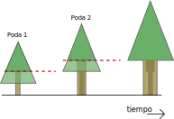
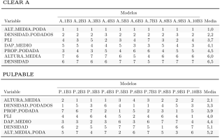
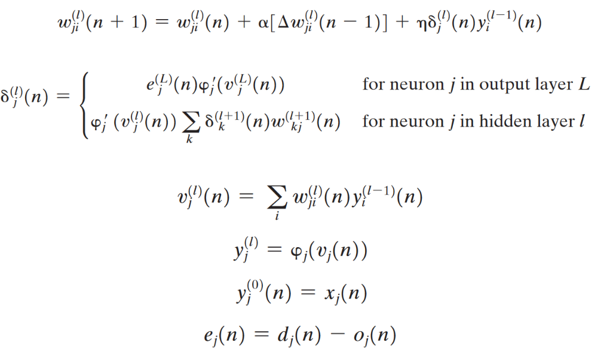

```{r setup, include=FALSE}
options(htmltools.dir.version = FALSE)
knitr::opts_chunk$set(message = FALSE, warning = FALSE)
library(tidyverse)
```

background-image: url(img/ucn.png)
background-size: 100px
background-position: 50% 7%


class: clear

<br><br><br>
<p style="text-align:center;font-size: 16px;letter-spacing: 0.1em;font-family: "Helvetica Neue", Helvetica, Arial, sans-serif;color: #337ab7 ;">
  UNIVERSIDAD CATÓLICA DEL NORTE
  <br>
  ESCUELA DE INGENIERÍA
  <br>
  INGENIERÍA CIVIL INDUSTRIAL</p>

<br>

<p style="text-align:center;font-size: 22px; font-weight: bold;color:#29445c;"> Creación de modelo para la estimación trozas de madera en plantaciones forestales de Forestal Mininco S.A</p>

<hr style="border-color:red;border:15px;background-color:#a93f2b;height: 2px">

<p style="text-align:center;font-size: 16px;border-style: solid;border-width: 0px 40px 4px 40px; border-color: white;letter-spacing: 0.08em;">
  MEMORIA PARA OPTAR AL GRADO DE LICENCIADO EN CIENCIAS DE LA INGENIERÍA Y AL TÍTULO DE INGENIERO CIVIL INDUSTRIAL</p>

<p style="text-align:center;font-size: 16px;letter-spacing: 0.1em;font-family: "Helvetica Neue", Helvetica, Arial, sans-serif;color: #337ab7 ;">
<br>
  Patricio Ignacio Said Peralta
<br>
  Prof. Guías:
<br>
  Ing. Civil Mecánico Pedro Reyes Norambuena
<br>
  Ing. Ingeniero Civil Informático Claudio Parada Véliz
</p>

---
# Agenda
.font150[
 
* Antecedentes de la industria  
* Problemática - Objetivo - Alcance 
* Marco Teórico  
  + Modelo RNA
  + Estado del arte  
* Metodología  
  + Obtención - Limpieza - Exploración de los datos  
  + Entrenamiento  
* Resultados  
  + Implementación  
* Conclusiones
]
---


<div style="position: absolute; top: 20%; left:8%;">


</div>

# Antecedentes de la industria forestal

---
# Antecedentes de la industria forestal

Exportaciones forestales en 2018  

```{r echo=FALSE , warning= F, message= F, fig.height=4, fig.width=13, fig.align= "center"}
datos5 <-  readxl::read_excel("datos/exportacion_pais.xlsx") 
datos5 <- datos5[order(datos5$Monto), ] 
datos5$País <- factor(datos5$País, levels = datos5$País[order(datos5$Monto)])

datos5 %>% filter(Porcentaje > 0.014) %>% 
  ggplot( aes(x = País, y = Monto)) + 
  geom_col(fill= "#6B8A47" ) +     
  coord_flip() +   
  geom_text(aes(  label = paste0(sub(".",",",
                                     as.character(round(Porcentaje*100,1)),fixed = T),"%")  ), 
            size = rel(5), fontface = "bold" , hjust= -0.1 , color = "gray33")+    
  scale_y_continuous(limits = c(0, 180) , 
                     labels =  function(x) format(x, big.mark = ".", scientific = FALSE)  ) +   
  theme_light()+   
  theme(        
        axis.title.y = element_text(size = rel(1.5), angle = 90),           
        axis.title.x = element_text(size = rel(1.5)),         
        axis.text.y =  element_text(size = rel(1.5)),
        axis.text.x = element_text(size = rel(1.5)))+       
   
  labs(     x = "País de destino",     y = 'Monto (US$ millones FOB)' , caption = "Fuente: INFOR"   )
```

<div style="position: absolute; top: 60%; left:7%;">


</div>

---

class: split-two

# Especie: *Pinus Radiata D.Don* 

<p style="font-size: 24px;"> **Orígen: California**  </p>
.column[

<div style="position: absolute; top: 30%; left:20%;">


</div>

]

.column[
<div style="position: absolute; top: 20%;margin:0px auto; text-align:center;">


</div>
]

???

áreas de la costa central de California, desde San Mateo por el norte hasta San Luis Obispo
por el sur; tambi´ en habitan bosques naturales de pino radiata en dos islas mexicanas, la Isla
Guadalupe y la Isla Cedro, ubicadas a 800 kil´ ometros al sureste de San Luis Obispo  
pino insigne es la con´ıfera m´ as sembrada en el mundo al ser
una especie de rápido crecimiento y de cualidades deseables para madera de construcción
y pulpa

---
class: split-two

# Rodales de Pino radiata 

<p style="text-align:center;font-size: 24px;">**Rodal** es una plancatión forestal (monoespecífica y coetánea).  </p>
.column[
<div style="position: absolute; top: 30%; left:10%;">


</div>

]

.column[
<div style="position: absolute; top: 30%;margin:0px auto; text-align:center;">


</div>
]

???

corresponde a la vegetación contenida en una superficie definida de terreno y se caracteriza por una cierta similitud de su población arbórea: son monoespecíficas y coetáneas

---
# El ciclo forestal 
<div style="position: absolute; top: 20%; left:20%;">


</div>

---
class: clear
**Elaboración de madera contrachapada o plywood** (Fuente: cmpcmaderas.cl)
<div style="position: absolute; top: 10%; left:5%;">
<embed src="img/plywood.swf" width="780" height="655"></embed>


---
class: split-two
# Tratamientos silvícolas
## La poda
.column[
<div style="position: absolute; top: 30%; left:10%;">


</div>

]

.column[
<div style="position: absolute; top: 20%;margin:0px auto; text-align:center;">


</div>
]


---
background-image: url(img/raleo.svg)
background-size: 700px
background-position: 50% 50%
#  Tratamientos silvícolas
## El raleo


---
background-image: url(img/trozado.svg)
background-size: 880px
background-position: 50% 50%
# Trozado de los productos
---
class:  clear,middle, center
background-image: url(img/flujo-trad.svg)
background-size: 80%

---
class: inverse, center, middle

# Estimaciones imprecisas ⇒ Desviaciones volumen progradamado/cosechado
---
class:  clear,middle, center
background-image: url(img/flujo-trad.svg)
background-size: 80%

---
class:  clear,middle, center
background-image: url(img/flujo.svg)
background-size: 80%
---
class: split-two
# Redes neuronales artificiales

.row[
<div style="position: absolute; top: 30%; left:25%;">


</div>

]

.row[
<div style="position: absolute; top: 5%; left:30%;">


</div>
]
---

# Redes neuronales artificiales

<div style="position: absolute; top: 15%; left:20%;">


</div>

<div style="position: absolute; top: 64%; left:3%;">


</div>

---
# Redes neuronales artificiales

#### Aplicaciones de RNA en la industria forestal:

* Modelo de Perceptrón multicapa para estimar calidad de madera aglomerada  (Melo y
Miguel, 2016).  
*  Modelo RNA con base radial para la predicción de la resistencia de tableros
aglomerados (Cook y Chiu, 1997; Fernández et al., 2008).
* Modelo RNA para clasificación de defectos en chapas de madera  (Pham y Sagiroglu, 2000; Ramírez Alonso y Chacón Murguía, 2005).  
* RNA para clasificar dos tipos de coníferas en Islas Canarias (Esteban et al., 2009).  
* RNA que apoya a la detección de incendios forestales  (Alonso-Betanzos
et al., 2003).  
* Modelo de predicción de mortalidad en plantaciones forestales  (Hasenauer et al., 2001).  
* RNA para estimar cobertura forestal  (Rodríguez et al., 2002).
* Modelo de RNA para estimar alturas de diferentes especies forestales (López et al., 2012; Martins et al., 2016).  
* Predicción del índice de sitio en bosques del Mediterráneo (Aertsen et al. 2010).  
* Modelos de RNA para estimar crecimiento y volúmenes de diferentes especies forestales (Vinícius Oliveira Castro et al., 2013; López, Arce, y Arévalo 2012; Miguel et al., 2016; De Oliveira Lima et al., 2017; Martins et al., 2016; Vieira et al., 2018).  
---

class:  clear,middle, center
background-image: url(img/esquema.svg)
background-size: 80%

---
class: inverse, center, middle

# ¿Con qué datos trabajar?

---

# Requerimiento de datos

* Información dasométrica de los rodales (provenientes de **inventarios forestales**)  
  + Diámetro a la altura de pecho (DAP) (a 1,3 metros del suelo)
  + Altura total  
  + Densidad de árboles, densidad de árboles podados
  + Altura podada  
  + Altura dominante, DAP dominante  
  + Área basal  
--

* Variables que afectan a la productividad   
  + Zonas de crecimiento  
  + Tipo de suelo  
  + Esquema de manejo (régimen silvícola)  
--

* Volúmenes de productos cosechados y superficie cosechada (desde reportes de faenas)  
* Rendimientos estimados de productos por un modelo tradicional
* Indicadores: Índice de sitio, PLI (pruned log index)  

Otras variables recolectadas y que no fueron considerados para el conjunto final de datos: pendiente del rodal, tipo de máquinas en la cosecha, empresa cosechadora


---

# Inventarios forestales

<div style="position: absolute; top: 20%; left:7%;">


</div>

---
# Zona de estudio

```{r out.width='100%', fig.height=7, eval=require('leaflet'),echo=FALSE  }
library(leaflet)
leaflet() %>% addTiles() %>% setView(-77.344, -34.597, zoom = 5) %>%
    addRectangles(
    lng1= -74.575, lat1=-34.886,  
    lng2= -70.192, lat2=-40.830, 
    fillColor = "transparent") %>% addProviderTiles(providers$Stamen.Toner)
```
---
# Zonas de crecimiento y tipos de suelos

<div style="position: absolute; top: 15%; left:5%;">


</div>

---


background-image: url(img/limpieza.svg)
background-size: 320px
background-position: 93% 83%

# Limpieza de datos
#### Corrección/eliminación de inconsistecias, registros faltantes, duplicados, normalización, ordenamiento y estructura del conjunto. 

### **Conjunto de datos acorde a los alcances del proyecto:**  
* Inventarios de pre-cosecha  
  + Tiempo inventario-cosecha < 5 años
  + Rodales adultos > 15 años
* Superficie cosechada (rodal) > 5 ha  
* Volumen cosechado (rodal) > 1000 m³
* Inconsistencia en volúmenes:  
  + Ejemplo: producto podado en rodades pulpable  
* Rodales con volumen siniestrado (no considerados)  


---
# Exploración de los datos

```{r echo=FALSE , warning= F, message= F}
library(highcharter)
datos <- readxl::read_excel("datos/datos_inventarios.xlsx")

#datos3$COD_Z_CPINO <- as.factor(datos3$COD_Z_CPINO) 
#levels(datos3$COD_Z_CPINO) <- c("I" , "II" , "III" , "IV" , "V" , "VI" , "VII" , "VIII" , "IX" , "X")
datos$ESQUEMA <- factor(datos$ESQUEMA,     levels = c('INTENSIVO','EXTENSIVO' , "MULTIPROPOSITO" , "PULPABLE"),ordered = TRUE) 
levels(datos$ESQUEMA) <- c("Intensivo" , "Extensivo" , "Multipropósito" , "Pulpable") 

x <- c("ESQUEMA", "ALTURA_MEDIA", "DAP_MEDIO", "EDAD_OT", "DENSIDAD")
y <- str_c("{point.", x, "}")
x <- str_replace_all(x, "_", " ")
tt <- tooltip_table(x, y)


hc3 <- hchart(datos, "scatter", hcaes(x = DAP_MEDIO, y = ALTURA_MEDIA, group = ESQUEMA)) %>% 
  hc_tooltip(pointFormat = tt, useHTML = TRUE, headerFormat = "") %>% 
  hc_title(
    text = "Relación altura media y DAP medio por rodales.",
    useHTML = TRUE) %>% 
  hc_yAxis(title= list(text="Altura media (m)",
                       style = list(fontSize = "15px")),
           labels = list(style = list(fontSize = "11px"))) %>% 
  hc_xAxis(title= list(text="Dap medio (cm)",
                       style = list(fontSize = "15px")),
           labels = list(style = list(fontSize = "11px")))

htmlwidgets::saveWidget(hc3, "highchrt_ex3.html")
```

<iframe src="highchrt_ex3.html" width = "800px", height = "580px" frameBorder="0"></iframe>

---

# Exploración de los datos

```{r echo=FALSE , warning= F, message= F}

#datos3$COD_Z_CPINO <- as.factor(datos3$COD_Z_CPINO) 
#levels(datos3$COD_Z_CPINO) <- c("I" , "II" , "III" , "IV" , "V" , "VI" , "VII" , "VIII" , "IX" , "X")


hc4 <- hchart(datos, "scatter", hcaes(x = EDAD_OT, y = ALTURA_MEDIA, group = ESQUEMA)) %>% 
  hc_tooltip(pointFormat = tt, useHTML = TRUE, headerFormat = "") %>% 
  hc_title(
    text = "Relación la altura media del rodal y la edad en el inventario.",
    useHTML = TRUE) %>% 
  hc_yAxis(title= list(text="Altura media (m)",
                       style = list(fontSize = "15px")),
           labels = list(style = list(fontSize = "11px"))) %>% 
  hc_xAxis(title= list(text="Edad en el inventario (años)",
                       style = list(fontSize = "15px")),
           labels = list(style = list(fontSize = "11px"))) 

htmlwidgets::saveWidget(hc4, "highchrt_ex4.html")
```

<iframe src="highchrt_ex4.html" width = "800px", height = "580px" frameBorder="0"></iframe>


---

# Exploración de los datos

```{r echo=FALSE , warning= F, message= F}

hc5 <- hchart(datos, "scatter", hcaes(x = DAP_MEDIO, y = DENSIDAD, group = ESQUEMA)) %>% 
  hc_tooltip(pointFormat = tt, useHTML = TRUE, headerFormat = "") %>% 
  hc_title(
    text = "Relación la altura media del rodal y la edad en el inventario.",style = list(fontSize = "14px"),
    useHTML = TRUE) %>% 
  hc_yAxis(title= list(text="Densidad (arb/ha)",
                       style = list(fontSize = "13px")),
           labels = list(style = list(fontSize = "11px"))) %>% 
  hc_xAxis(title= list(text="Dap medio (cm)",
                       style = list(fontSize = "13px")),
           labels = list(style = list(fontSize = "11px"))) 

htmlwidgets::saveWidget(hc5, "highchrt_ex5.html")
```
<div style="position: absolute; top: 9%; left:10%;">
<iframe src="highchrt_ex5.html" width = "700px", height = "610px" frameBorder="0"></iframe>
<div>

---
class: clear

```{r echo=FALSE , warning= F, message= F}
datos <- readxl::read_excel("datos/datos_inventarios.xlsx")

library(tidyverse)
library(plotly)
#datos3$COD_Z_CPINO <- as.factor(datos3$COD_Z_CPINO) 
#levels(datos3$COD_Z_CPINO) <- c("I" , "II" , "III" , "IV" , "V" , "VI" , "VII" , "VIII" , "IX" , "X")
datos$ESQUEMA <- factor(datos$ESQUEMA,     levels = c('INTENSIVO','EXTENSIVO' , "MULTIPROPOSITO" , "PULPABLE"),ordered = TRUE) 
levels(datos$ESQUEMA) <- c("Intensivo" , "Extensivo" , "Multipropósito" , "Pulpable") 

p <- plot_ly(datos, x = ~DAP_MEDIO, y = ~ALTURA_MEDIA, z = ~DENSIDAD, 
        marker = list(color = ~AREA_BASAL, colorscale = c('#ffb3a1', '#683531'),size = 5, showscale = TRUE)) %>%
  add_markers() %>%
  layout(scene = list(xaxis = list(title = 'DAP medio (cm)'),
                     yaxis = list(title = 'Altura media (m)'),
                     zaxis = list(title = 'Densidad (arb/ha)')),
         annotations = list(
           x = 1.13,
           y = 1.05,
           text = 'Área basal (m²/ha)',
           xref = 'paper',
           yref = 'paper',
           showarrow = FALSE
         ))

htmlwidgets::saveWidget(p, "plotly1.html")
```
<div style="position: absolute; top: 0%; left:0%;">
<iframe src="plotly1.html" width = "1000px", height = "700px" frameBorder="0"></iframe>
<div>

---
# Exploración de los datos


```{r echo=FALSE , warning= F, message= F, fig.height=8, fig.width=10, fig.align= "center"}
datos2 <- datos  
  
p1 <- ggplot(datos2, aes(x=DAP_MEDIO)) +     
  geom_histogram(aes(fill = ESQUEMA) ,binwidth = 1) +     
  theme_minimal() +     
  labs( x = "DAP medio (cm)", y ="Frecuencia de rodales",fill = "Esquema de manejo", title = "a") +
  scale_fill_manual(values=c( "#61B087", "#FF834C", "#a3c3c4", "#FFC038" ))+ 
  theme(legend.position="bottom",         
        legend.text = element_text(size=12),               	
        legend.title = element_text(size=14))  
p2 <- ggplot(datos2, aes(x=ALTURA_MEDIA)) +  
  geom_histogram(aes(fill = ESQUEMA) ,binwidth = 1) +  
  theme_minimal() +  
  labs( x = "Altura media (m)" , y = "", title = "b")+ 
  scale_fill_manual(values=c( "#61B087", "#FF834C", "#a3c3c4", "#FFC038" ))  
p3 <- ggplot(datos2, aes(x=DENSIDAD)) +  
  geom_histogram(aes(fill = ESQUEMA) ,binwidth = 40) +  
  theme_minimal() +  
  labs( x = "Densidad media (arb/ha)" , y = "Frecuencia de rodales" , title = "c")  +    
  scale_fill_manual(values=c( "#61B087", "#FF834C", "#a3c3c4", "#FFC038" )) 
p4 <- ggplot(datos2, aes(x=DENSIDAD_PODADOS)) + 
  geom_histogram(aes(fill = ESQUEMA) ,binwidth = 30) +  
  theme_minimal() +  
  labs( x = "Densidad podada media (arb/ha)" , y = "" , title = "d") + 
  scale_fill_manual(values=c( "#61B087", "#FF834C", "#a3c3c4", "#FFC038" ))
g_legend<-function(a.gplot){    
tmp <- ggplot_gtable(ggplot_build(a.gplot))    
leg <- which(sapply(tmp$grobs, function(x) x$name) == "guide-box")    
legend <- tmp$grobs[[leg]]    
return(legend)} 
mylegend<-g_legend(p1)  
library(gridExtra) 
p5 <- grid.arrange(arrangeGrob(p1 + theme(legend.position="none"),                         
                               p2 + theme(legend.position="none"),  						
                               p3 + theme(legend.position="none") ,  						
                               p4 + theme(legend.position="none"),nrow=2),              					
                   mylegend, nrow=2,heights=c(12, 1))
```


---
# Exploración de los datos

```{r echo=FALSE , warning= F, message= F, fig.height=7.4, fig.width=10, fig.align= "center"}
datos <- readxl::read_excel("datos/datos_clean.xlsx")
datos2 <- datos
datos_gather <- datos2 %>%  
 select( ESQUEMA, REND_CLEAR_A_REAL , REND_CLEAR_B_REAL , REND_IND_REAL , REND_PULP_REAL) %>%    
  gather(Producto, Rendimiento, -ESQUEMA) 
datos_gather$Producto <- as.factor(datos_gather$Producto) 
levels(datos_gather$Producto) <- c("Podado" , "Semipodado" , "Industrial" , "Pulpable")
datos_gather$ESQUEMA <- factor(datos_gather$ESQUEMA,     levels = c('INTENSIVO','EXTENSIVO' , "MULTIPROPOSITO" , "PULPABLE"),ordered = TRUE) 
levels(datos_gather$ESQUEMA) <- c("Intensivo" , "Extensivo" , "Multipropósito" , "Pulpable") 


ggplot(datos_gather, aes( y= Rendimiento , x = ESQUEMA, fill = Producto ) )+
  geom_boxplot() +  
  labs(x = "Esquema de manejo" , 
  y  = "Rendimiento (m³/ha)") +
  ylim(0,600) + 
  theme_minimal()+
  theme( legend.position = "bottom", #legend.box.spacing = unit(0 , "cm"),  
         axis.text.x=element_text(size=12) ,  	
         axis.text.y=element_text(size=12) ,  	
         legend.text = element_text(size=12),               	
         legend.title = element_text(size=14) ,          	
         axis.title.x=element_text( size=14),               	
         axis.title.y =element_text(size=14))+ 
  scale_fill_manual(values=c( "#61B087", "#FF834C", "#a3c3c4", "#FFC038" ))+
  ggtitle("Rendimiento (observado) de productos según esquema de manejo")
```


---
# Pre-procesamiento de los datos

### Normalización:  
Los datos se escalaron en un rango de [0 a 1]
$$X_{escalado}=\frac{X-X_{min}}{X_{min}-X_{max}}$$  
--

### Variables ficticias:

Las variables de tipo factor => *dummy variables*  
* Zona de crecimiento 
  + (10 zonas: I a X)  
* Tipo de suelo  
  + (8 tipos: trumao, sedimentos marinos, secano, metamórficos, graníticos, arenas, arcilloso, aluviales)  
* Esquema de manejo  
  + (4 esquemas: Intensivo, extensivo, multipropósito, pulpable)  
* PLI  
  + (2 estados : con o sin potencial para extraer madera *clear*)  

---

class: clear

### Variables ficticias para la variable `zona de crecimiento`  

<div style="position: absolute; top: 20%;  left:27%;">


```{r  echo = F, message = F , eval = T, warning = F}
library(kableExtra) 
library(tidyverse)

datos <- data.frame(E1 = c(1,0,0,0,0,0,0,0,0,0), 
                    E2 = c(0,1,0,0,0,0,0,0,0,0),
                    E3 = c(0,0,1,0,0,0,0,0,0,0),
                    E4 = c(0,0,0,1,0,0,0,0,0,0),
                    E5 = c(0,0,0,0,1,0,0,0,0,0),
                    E6 = c(0,0,0,0,0,1,0,0,0,0),
                    E7 = c(0,0,0,0,0,0,1,0,0,0),
                    E8 = c(0,0,0,0,0,0,0,1,0,0),
                    E9 = c(0,0,0,0,0,0,0,0,1,0),
                   E10 = c(0,0,0,0,0,0,0,0,0,1)
)
rownames(datos)<- c("Zona I", "Zona II", "Zona III",
                    "Zona IV", "Zona V", "Zona VI", "Zona VII",
                    "Zona VIII", "Zona IX", "Zona X")
datos %>% kable()%>%
kable_styling(bootstrap_options = c("striped", "hover", "condensed"))
```

</div>
  

---


# Estructura del conjunto de datos

#### *data frame* de dimensión *864 x 39*  

<div style="position: absolute; top: 35%; left:1%;">


</div>
---
# Partición del conjunto de datos

#### División aleatoria en 70-15-15

<div style="position: absolute; top: 25%; left:15%;">


</div>

<br/><br/>
<br/><br/>
--
<h4> Objetivos de la partición:  </h4>


<p> 
<ul>

<li> Detener entrenamiento </li>
<li> Evaluar el entrenamiento con un conjunto independiente</li>
<li> Evitar <b><i>overfitting</i></b> </li>
</ul>
</p> 

--
<div style="position: absolute; top: 70%; left:5%;">


</div>


<div style="position: absolute; top: 68%; left:73%;">


</div>
---
class: inverse, center, middle

# Entrenamiento de los modelos
<html><div style='float:left'></div><hr color='#EB811B' size=1px width=720px></html>

---

# Configuración de las RNA

#### Búsqueda de parámetros *"Grid Search"*  
* **Arquitectura de las redes** : 
  + **Capa de entrada**: Según las variables de entradas. [35] (nodos) para 15 variables, [17] para 8 variables, [7] 7 variables.
  + **Capas ocultas**: [10], [20], [32], [50], [20:20], [30:30], [56:56], [120:120:120], [256:256], [20:20:20], [128:128:128],[300:300] , [100:300:100], [300:300:300],
[256:256:256], [56:56:56:56].
  + **Capa de salida**: Rendimiento de cada producto.  
* **Función de activación**:  
  + `tanh`
  + `rectifier` (`ReLU`)  
  + `maxout`   
* **Tasa de aprendizaje**:  
  +  0.005 ,0.02, 0.05, 0.1, 0.25, 0.5.  
* **Criterios de detención**:  
  + **Épocas**:  20, 50, 100, 500, 800.
  + **Rondas**:  3, 4.  
      + 4% de ECM.  
      
---

# Métricas de precisión   

Para la evaluación de los modelos se consideraron:  

<!-- $${MSE}=\frac{1}{n}\sum_{i=1}^{n}(y_{i}-\hat{y_{i}})^{2}$$ -->
$${RECM}=\sqrt{\frac{1}{n}\sum_{i=1}^{n}(y_{i}-\hat{y_{i}})^{2}}$$
$${EAM}=\frac{1}{n}\sum_{i=1}^{n}|y_{i}-\hat{y_{i}}|$$
$${R}_{y\hat{y}}=\frac{n\sum y_{i}\hat{y_{i}}-\sum y_{i}\sum\hat{y_{i}}}{\sqrt{n\sum y_{i}^{2}-(\sum y_{i})^{2}}\sqrt{n\sum\hat{y}_{i}^{2}-(\sum\hat{y_{i}})^{2}}}$$
donde, $y_{i}$ rendimiento observado , $\hat{y_{i}}$ rendimiento estimadio y $n$ cantidad de observaciones.  
---
# Métricas de precisión   

```{r  echo = F, message = F , eval = T, warning = F}
library(knitr)
library(kableExtra) 
library(tidyverse) 
library(tidyr)
datos_tabla <- readxl::read_excel("datos/tabla_errores.xlsx")

datos_tabla %>%   select(-starts_with("MSE")) %>% 
  kable( format.args = list(decimal.mark = ',', big.mark = "."),
         col.names = c("Salida", "Modelo",rep(c("RECM","EAM","R"),3)), 
         digits = c(1,1,rep(c(2,2,4),3)))%>%    		
  kable_styling(bootstrap_options =c( "condensed", "stripped"),font_size = 13)%>% 
  add_header_above(c(" "=2, "Entrenamiento (n = 608)"= 3, "Validación (n = 127)" = 3, "Prueba (n = 129)" = 3)) %>% 
     collapse_rows(columns = 1, valign = "top") 
```
---
# Métricas de precisión   

```{r  echo = F, message = F , eval = T, warning = F}
 datos_tabla <- readxl::read_excel("datos/tabla_errores.xlsx")

datos_tabla %>%   select(-starts_with("MSE")) %>% 
  kable( format.args = list(decimal.mark = ',', big.mark = "."),
         col.names = c("Salida", "Modelo",rep(c("RECM","EAM","R"),3)), 
         digits = c(1,1,rep(c(2,2,4),3)))%>%    		
  kable_styling(bootstrap_options =c( "condensed", "stripped"),font_size = 13)%>% 
  add_header_above(c(" "=2, "Entrenamiento (n = 608)"= 3, "Validación (n = 127)" = 3, "Prueba (n = 129)" = 3)) %>%  
     collapse_rows(columns = 1, valign = "top") %>% 
  row_spec(c(3,7,11,15), bold = T, color = "white", background = "#D7261E") %>% 
  row_spec(c(3,7,11,15)+1, bold = T)
```
---
# Configuraciones de los modelos de RNA

```{css, echo=F}
    /* Table width = 100% max-width */

    .remark-slide table{
        width: 100%;
    }

    /* Change the background color to white for shaded rows (even rows) */

    .remark-slide thead, .remark-slide tr:nth-child(2n) {
        background-color: white;
    }
```

```{r  echo = F, message = F , eval = T, warning = F}

tabla<- readxl::read_excel("datos/resultados_1.xlsx")

tabla <- tabla%>% mutate(tasa_a= str_replace(tasa_a,"0.","0,"))
tabla$...1 <- paste("RNA" , c(1:12),sep = "")
 tabla %>%   select(Salida, everything()) %>% 
  kable("html", booktabs= T,col.names = c("Salida" , "Modelo","Entradas", "Capas ocultas", "F(X)","$\\alpha$" ))%>%    		
  kable_styling(bootstrap_options =c("hover", "condensed", "stripped"),font_size = 13) %>% 
   collapse_rows(columns = 1, valign = "middle") %>% 
  footnote(symbol_manual = "",
           symbol =("Donde, DAP: diámetro a la altura de pecho promedio(cm); DAP Dom: diámetro a la altura de pecho dominante; HT: altura total media (m); H Dom: altura dominante (m); D: densidad media (arb/ha); DP: densidad podada (arb/ha); PP: proporción podada (%); G: área basal (m²/ha); E: edad en inventario (años); índice de sitio (m); HP: altura podada media (m), PLI: pruned log index (binario); TZ: tipo zona de crecimiento; TE: tipo de esquema de manejo; TS: tipo de suelo; $\\alpha$ = tasa de aprendizaje. Variable de salida en m³/ha."),threeparttable = T)    
 

```

---
# Configuraciones de los modelos de RNA

```{css, echo=F}
    /* Table width = 100% max-width */

    .remark-slide table{
        width: 100%;
    }

    /* Change the background color to white for shaded rows (even rows) */

    .remark-slide thead, .remark-slide tr:nth-child(2n) {
        background-color: white;
    }
```

```{r  echo = F, message = F , eval = T, warning = F}

tabla<- readxl::read_excel("datos/resultados_1.xlsx")

tabla <- tabla%>% mutate(tasa_a= str_replace(tasa_a,"0.","0,"))
tabla$...1 <- paste("RNA" , c(1:12),sep = "")
 tabla %>%   select(Salida, everything()) %>% 
  kable("html", booktabs= T,col.names = c("Salida" , "Modelo","Entradas", "Capas ocultas", "F(X)","$\\alpha$" ))%>%    		
  kable_styling(bootstrap_options =c("hover", "condensed", "stripped"),font_size = 13) %>% 
   collapse_rows(columns = 1, valign = "middle")  %>% 
  row_spec(c(3,6,9,12), bold = T, color = "white", background = "#D7261E") %>% 
  footnote(symbol_manual = "",
           symbol =("Donde, DAP: diámetro a la altura de pecho promedio(cm); DAP Dom: diámetro a la altura de pecho dominante; HT: altura total media (m); H Dom: altura dominante (m); D: densidad media (arb/ha); DP: densidad podada (arb/ha); PP: proporción podada (%); G: área basal (m²/ha); E: edad en inventario (años); índice de sitio (m); HP: altura podada media (m), PLI: pruned log index (binario); TZ: tipo zona de crecimiento; TE: tipo de esquema de manejo; TS: tipo de suelo; $\\alpha$ = tasa de aprendizaje. Variable de salida en m³/ha."),threeparttable = T)  

```

---
# Dispersión de errores (Prueba)

```{r echo=FALSE , warning= F, message= F, fig.height=7.4, fig.width=10, fig.align= "center"}
datos_2 <- readxl::read_excel("datos/tabla_errores_graficas.xlsx") 
library(ggplot2)
datos_2 %>%  
  mutate(conjunto = factor(conjunto,
                        levels=c("train", "valid","test"), 
                        labels = c("Entrenamiento","Validación","Prueba"))) %>% 
  mutate(producto = factor(producto_2, 
                       labels = c("Clear A","Clear B","Industrial","Pulpable" ))) %>% 
  mutate(error = real - estimado) %>%
  filter(conjunto == "Prueba") %>% 
ggplot( aes(x = estimado , y= error, color =Modelo))+
  geom_point(alpha = 1, size= 2)+       
  labs(x= "Estimado", y= "Error")+    
  labs(color = "Modelo")+     
  facet_wrap(~ producto ,ncol = 2,  scales = "free" )+    
  theme_light()+ 
  theme(legend.position="bottom",legend.box.spacing = unit(0, "cm"), 
                legend.spacing.y = unit(1, 'cm'),
        strip.text.x = element_text(margin = margin(0.1, 0.1, 0.1, 0.1, "cm") , 
                                    size = 12, color = "black") , 
        axis.text.x = element_text(size = 10), 
        axis.text.y = element_text(size = 10),
        axis.title.x = element_text(size = 12),
        axis.title.y = element_text(size = 12),
        legend.text = element_text(size = 12),
        legend.title  = element_text(size = 12))
```
---
# Dispersión de errores (Prueba)

```{r echo=FALSE , warning= F, message= F, fig.height=8, fig.width=10, fig.align= "center"}
datos_2 <- readxl::read_excel("datos/tabla_errores_graficas.xlsx") 
datos_2 %>%  
  mutate(conjunto = factor(conjunto,levels=c("train", "valid","test"), 
                                    labels = c("Entrenamiento","Validación","Prueba"))) %>% 
  mutate(producto = factor(producto_2, 
                                    labels = c("Clear A","Clear B","Industrial","Pulpable" ))) %>% 
  mutate(error = real - estimado) %>% 
  filter(conjunto == "Prueba")%>% 
ggplot( aes(x=error, fill=Modelo)) +   
  geom_histogram( position="dodge", bins = 8, alpha= 1)+    
  labs(y= "Frecuencia", x= "Error", color= "Modelo" , fill="Modelo")+
  theme_light()+    
  facet_wrap(~producto,ncol = 2,  scales = "free")+  
  theme(legend.position="bottom",legend.box.spacing = unit(0, "cm"), 
                legend.spacing.y = unit(1, 'cm'),
        strip.text.x = element_text(margin = margin(0.1, 0.1, 0.1, 0.1, "cm") , 
                                    size = 12, color = "black") , 
        axis.text.x = element_text(size = 10), 
        axis.text.y = element_text(size = 10),
        axis.title.x = element_text(size = 12),
        axis.title.y = element_text(size = 12),
        legend.text = element_text(size = 12),
        legend.title  = element_text(size = 12)
  ) 
```
---
# Historial del RECM en el entrenamiento

<div style="position: absolute; top: 20%; left:5%;">


</div>

---
# Variables de importancia

<div style="position: absolute; top: 20%; left:5%;">



</div>


---
class: inverse, middle, center  

# Implementación

<html><div style='float:left'></div><hr color='#EB811B' size=1px width=720px></html>

---
background-image: url(img/paquetes.png)
background-size: 800px
background-position: 50% 8%
# Software utilizado  

---

# Web app: <a href="https://psaid.shinyapps.io/ainsigne/ "> psaid.shinyapps.io/ainsigne </a>


<div class = "l-page"  style="top: 10%; left:0%;">
<iframe src="https://psaid.shinyapps.io/ainsigne/" width="700%" height="550px"
style="border:none;"></iframe>
</div>

---

# Conclusiones  


---


class: clear,center, middle, inverse

# Gracias

Códigos y datos utilizados: [**patosaid.github.io/ainsigne**](https://patosaid.github.io/ainsigne/)


---


# Referencias   


<div style="font-size:12pt">

<ul>
<li>Aertsen, Wim, Vincent Kint, Jos van Orshoven, Kürşad Özkan, y Bart Muys. 2010. «Comparison and ranking of different modelling techniques for prediction of site index in Mediterranean mountain forests». Ecological Modelling 221 (8):1119-30.</li> 
<li>Alonso-Betanzos, A., Fontenla-Romero, O., Guijarro-Berdinas, B., Hernández-Pereira, E., Andrade, M. I. P., Jiménez, E., Soto, J. L. L., y Carballas, T. (2003). An intelligent system for forest fire risk prediction and fire fighting management in galicia. Expert Systems with Applications, 25(4):545–554.</li>  
<li>Cook, D. F. y Chiu, C.-C. (1997). Predicting the internal bond strength of particleboard, utilizing a radial basis function neural network. Engineering Applications of Artificial Intelligence , 10(2):171–177.</li> 
<li>De Oliveira Lima, Mirella Basileu, Ilvan Medeiros Lustosa Junior, Elian Meneses Oliveira, J&essica Cristina Barbosa Ferreira, Kálita Luis Soares, y Eder Pereira Miguel. 2017. «Artificial neural networks in whole-stand level modeling of Eucalyptus plants». African Journal of Agricultural Research 12 (7): 524-34.</li>  
<li>Esteban, L. G., Fernández, F. G., de Palacios de Palacios, P., Romero, R. M., y Cano, N. N. (2009). Artificial neural networks in wood identification: The case of two juniperus species from the canary islands. IAWA Journal, 30(1):87–94.</li>
<li>Fernández, F. G., Esteban, L. G., Palacios, P. D., Navarro, M., y Conde, M. (2008). Prediction of standard particleboard mechanical properties utilizing an artificial neural network and subsequent comparison with a multivariate regression model. Investigación Agraria: Sistemas y Recursos Forestales, 17(2):178.</li>
<li>Hasenauer, H., Merkl, D., y Weingartner, M. (2001). Estimating tree mortality of norway spruce stands with neural networks. Advances in Environmental Research, 5(4):405–414.</li> 
<li>Haykin, Simon S. (2009). Neural networks and learning machines. New York: Prentice Hall.</li> 
<li> Lopez, J., Arce, C., y Arévalo, R. (2012). Aplicación de la técnica de redes neuronales para la predicción de la altura de árboles de algunas especies maderables promisorias presentes en plantaciones forestales de colombia. Revista Tumbaga, 7:97–106.</li>


</ul>
</div>

---
# Referencias  

<div style="font-size:12pt">

<ul>
<li>Martins, E., Binoti, M., Leite, H., Binoti, D., y Dutra, G. (2016). Configuracao de redes neurais artificiais para estimacao da altura total de árvores de eucalipto. Revista Brasileira de Ciencias Agrárias - Brazilian Journal of Agricultural Sciences, 11(2):117–123.</li>
<li>Melo, R. R. d. y Miguel, E. P. (2016). Use of artificial neural networks in predicting particleboard quality parameters. Revista Arvore, 40(5):949–958.</li>
<li>Pham, D. T. y Sagiroglu, S. (2000). Neural network classification of defects in veneer boards. Proceedings of the Institution of Mechanical Engineers, Part B: Journal of Engineering Manufacture , 214(3):255–258.</li> 
<li>Ramírez Alonso, G. M. d. J. y Chacón Murguía, M. I. (2005). Clasificación de defectos en madera utilizando redes neurales artificiales. Computación y Sistemas, 9(1):17–27.</li>
<li>Rodríguez, E. B., P´ erez, E. V., Ovalle, Á. L., y Domínguez, S. T. (2002). Aplicación de redes neuronales artificiales y técnicas sig para la predicción de coberturas forestales. Revista Chapingo. Serie Ciencias Forestales y del Ambiente, 8(1):31–37.</li>
<li>Tariq Rashid (2007). A Gentle Introductionto Neural Networks(with Python) PyCon Italy, https://www.pycon.it/media/conference/slides/a-gentle-introduction-to-neural-networks-with-python.pdf.</li>
<li>Vinícius Oliveira Castro, Renato, Carlos Pedro Boechat Soares, Helio Garcia Leite, Agostinho Lopes de Souza, Gilciano Saraiva Nogueira, y Fabrina Bolzan Martins. 2013. «Individual growth model for Eucalyptus stands in Brazil using artificial neural network». ISRN Forestry 2013.</li>
</ul>
</div>

---


class: inverse, center, middle

# Anexos

<html><div style='float:left'></div><hr color='#EB811B' size=1px width=720px></html>
---
background-image: url(img/anexo/1.PNG)
background-size: 750px
background-position: 50% 35%
# El perceptrón multicapa MLP

---
background-image: url(img/anexo/2.PNG)
background-size: 500px
background-position: 45% 35%
# El perceptrón multicapa MLP

---
class: split-two
background-image: url(img/anexo/3.PNG)
background-size: 700px
background-position: 50% 10%
# El perceptrón multicapa MLP

.row[

]

.row[
$$ W_{ij} Y_i = V_j$$
$$ Y_j = F(V_j)$$
]
.row[

<div style="position: absolute; top: 68%; left:10%;">


</div>
]

---
background-image: url(img/anexo/gradiente.PNG)
background-size: 850px
background-position: 50% 35%
# El perceptrón multicapa MLP

### Descenso de la gradiente 

---
background-image: url(img/anexo/gradiente2.PNG)
background-size: 750px
background-position: 50% 55%
# El perceptrón multicapa MLP

### Descenso de la gradiente 

---
background-image: url(img/anexo/valle.PNG)
background-size: 750px
background-position: 50% 55%
# El perceptrón multicapa MLP

### Descenso de la gradiente 

---
background-image: url(img/anexo/gradiente3.PNG)
background-size: 600px
background-position: 50% 10%
# El perceptrón multicapa MLP

--

<div style="position: absolute; top: 40%; left:15%;">


</div>


